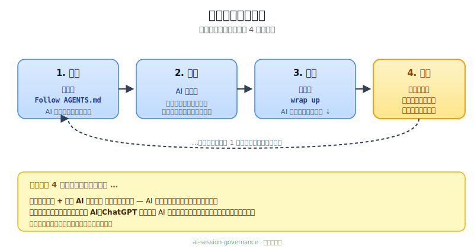
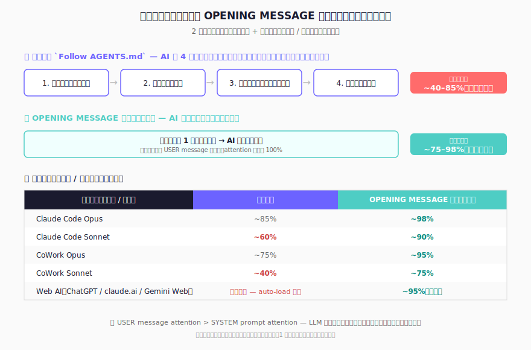

[English](README.md) | [繁體中文](README.zh-TW.md) | [简体中文](README.zh-CN.md) | 日本語

# :rocket: AIツール間の引き継ぎを支える開発ガバナンステンプレート

Codex、Claude、Gemini のトークン配分を使い切ったら、引き継ぎブロックを次のツールに貼り付けるだけ。同じ状態から続けられます。

- 異なるAI CLIツール間で引き継ぎが機能する
- 統一ワークフロー：`PLAN -> READ -> CHANGE -> QC -> PERSIST`
- ルールを増やし続けるのではなく、ガバナンスのドリフトを防ぐ
- セッション継続性に特化したHarness Engineeringコンポーネント

**[セッションの流れ](#quickstart)** · **[インストール](#install)** · **[アップグレード](#upgrade)** · **[クイック操作](#quick-operations)**


> **🆕 初めての方へ** まず 5 分ほどで **[インタラクティブな紹介ページ](https://prompt-templates.github.io/ai-session-governance/?lang=ja)** を見て、このテンプレートの機能と設計思想を視覚的に把握することをおすすめします。本 README の他の章を読むのはその後でも遅くありません。


---

## :bookmark_tabs: なぜこれが必要か

複数のAIツールを使う開発では、まず壊れるのは引き継ぎで、生成品質ではありません。

よくある失敗パターン：
- ツールを切り替えるたびに最初から説明し直す
- 修正が修正の上に積み重なってルールが煩雑になる
- README・引き継ぎ文書・ログが食い違ってくる

このテンプレートは次の3点を必須にします。
1. セッションごとに単一の再開経路を持つ
2. すべての作業を同じワークフローで進める
3. セッションを閉じる前に追跡可能な記録を残す

---

## :bookmark_tabs: 内蔵セーフガード

よくあるAIの失敗パターンもカバーしています。

| セーフガード | 防止する問題 |
|---|---|
| **PLANリスク評価** | 高リスクタスク（3ファイル以上、スコープ不明、破壊的操作、外部システム）をAIが正しく理解したか確認する前に実行すること — 高リスクプランはユーザー確認まで一時停止 |
| **外部 API コード安全** | 訓練データの記憶からエンドポイント / パラメータ / スキーマを推測して API 呼び出しコードを書くこと |
| **ローカルツール / SDK / skill 整合** | 訓練データの記憶からローカル CLI flag、SDK 構文、パッケージマネージャコマンド、skill 動作を推測すること — 外部 API と同じ整合原則：ドキュメントソースを優先（プロジェクト SSOT > skill 説明 / runbook > `--help` / `--version` > 公式 docs）；不確実なら invoke 前に UNVERIFIED とフラグ |
| **プロジェクトコンテキストスナップショット** | セッション切り替えのたびにプロジェクトのツール・サービス・主要決定を再学習すること |
| **テスト計画ガバナンス** | シナリオマトリックスなしで変更をマージすること — 期待結果と実績が未記録になること |
| **統合規律** | 既存ルールを更新すべきか確認せずに規則を積み上げ続けること |
| **文書同期レジストリ** | 変更後にどの文書を更新すべきか推測すること — `DOC_SYNC_CHECKLIST.md` が変更カテゴリと必要更新を対応付け、AIが自己判断せずに参照できる |
| **セッションログ自動メンテナンス** | セッション履歴が数千行に増えてAIの起動コンテキストを圧迫すること — クローズ時にAIがトリガー条件で古い履歴を自動整理し、起動コンテキストを軽く保つ |
| **QC失敗パス** | AIがテスト失敗をサイレントリトライまたは放棄すること — テストやビルドが失敗した場合、AIは失敗内容を報告し原因を診断し、自動リトライせずユーザーの指示を待つ |
| **クローズアウト誤検知ガード** | 「ありがとう、これで大丈夫です」のような日常表現で完全なセッション終了が誤って発動すること — 表現が曖昧な場合、AIはセッション終了の意図を確認してから実行 |
| **応答行動ガバナンス** | AI が偽装した自由質問で決定をユーザーに押し戻す／選択肢に劣悪な候補を埋める／過剰な確認質問を出す／未確認の事実を確定として提示／内部 `§` コードを文の主語として使う — §11a（v3.0.3 ベースライン + v3.0.5 拡張）が 10 の応答ルールを必須化：judgement-first に役割分担を追加、規定された選択肢フォーマット（`🚀 *下一步揀一條*` + A/B/C + `💡 推薦`）、≤3 仮説 + ≤3 質問、`UNVERIFIED` と `NA` の区別、表層テキストは平易な言葉＋反例・正例、応答スケルトン（`🔎` ハイライト → 配信リスト → 本文）、機能 emoji 語彙（🔎/✅/❌/⚠️/📌/💡/🚀）、Output-only モード上書き、SSOT 逐語整合、応答レジスター一貫性 |
| **全体像優先プラン** | AI が複数ファイルやガバナンス変更を散文塊として投げ、エンドステート・配信・指標・受入・目標リンクを先に示さないこと — §3.5 FPFR（v3.0.5）が規定：≥2 ファイル / 新規ファイル / ガバナンス変更 / ≥2 段階プランの場合、5 つの固定セクション + 終結文を必須とする；「A 承認？B 承認？」の項目別承認は明示的に禁止 |
| **パッチ専用配信フォーマット** | AI がコード / spec / 設定変更を再生成された塊として配信、アンカー無し、before/after 無しでレビューやロールバックが困難 — §11b（v3.0.5）が規定：精密アンカーをコードブロック外に配置、BEFORE / AFTER 2 つのコードブロックには逐語テキストのみ、Changelog で added / removed / renamed / moved を列挙 |
| **クロスルール仲裁** | AI がルール衝突（例：「最小変更」vs「根本原因対処」）を恣意的に選択、一貫した優先順位無し — §0c（v3.0.5）が明文化された優先順位：検証可能な正確性 > 安定性 > 根本原因 > 配信完全性 > 最小変更；項目 1-4 は常に項目 5 を上書き |
| **ツールフォーマット硬規則** | AI が計算で過程を示さない、JSON にスキーマ無し、Mermaid の方向がランダム — §13（v3.0.5）が規定：計算 4 ステップ法（桁ごと + 符号判定 + 中間ステップ + 代入検証）、JSON スキーマ優先で必須欄位欠損は `null`、Mermaid `flowchart TB` 方向で `"..."` で text label を囲む |

### :small_blue_diamond: SESSION_LOG.md をコンパクトに保つ仕組み

`dev/SESSION_LOG.md` はセッション開始時に毎回読み込まれます。アクティブなプロジェクトでは、このファイルが数千行に膨らむことがあります——数か月前の今は関係ない履歴をすべてAIのコンテキストに読み込むことになります。

このテンプレートは「明示的なクローズ時チェック」で処理します（ルール記憶依存ではありません）：

- クローズ時にAIは `SESSION_LOG.md` が **400行超**か、**30日超**の古いエントリを含むかを確認する
- 条件に当たれば、AIは旧エントリを先にアーカイブしてから今回のクローズ記録を書く
- 条件に当たらなければ、AIはアーカイブをスキップして通常どおりクローズを書く
- 旧エントリは `dev/archive/` に移動（削除しない）し、四半期ごとに `SESSION_LOG_YYYY_QN.md` へ整理する
- アクティブログの目標は ≤ **200行**、かつ最新2セッションは必ず保持する
- 起動時にAIが読むのは `SESSION_LOG.md` のみ（アーカイブは読まない）

すでに大きなセッションログがある場合も、アップグレード後の最初のセッション終了時に自動で整理されます。手動操作は不要です。

---

## :bookmark_tabs: 最近のリリース

直近 5 バージョンのみ表示 — 過去のバージョンは [GitHub の完全なリリース履歴](https://github.com/prompt-templates/ai-session-governance/releases) を参照してください。

| バージョン | 変更内容 | あなたへのメリット |
|---|---|---|
| **v3.0.10** | Worktree セッションがすんなり動く。Claude Code を `git worktree` と組み合わせて運用する場合（ブランチごとに 1 つのワークツリー、セッションごとに 1 つ、など）、セッション起動時に `dev/SESSION_HANDOFF.md` / `dev/SESSION_LOG.md` がワークツリーのチェックアウトに含まれず躓くことがなくなりました — AI はメインリポジトリから自動的に読み込むようになり、file-not-found エラーやワークツリーへの空ファイル作成を回避します。リリース検証も同じ修正：ワークツリーから QA harness を実行した際に表示される 2 つの「failures」は、想定動作としてドキュメント化され、利用者が自分で調査する必要がなくなりました。あわせて zh-TW の小さな収斂：v3.0.8 行を v3.0.9 で確立した正式書面語のレジスターに合わせました。 | これまで worktree で Claude Code を開いて、存在しないファイルを探してさまようのを見守っていたなら、このバージョンでそれが終わります。リリース検証結果は実行場所に関係なく一貫し、「この 2 つの failure は本当か？」という疑念がなくなります。zh-TW は最近のバージョン間で読感が統一されました。 |
| **v3.0.9** | AI の返信があなたの書く言語に従うようになりました：中国語（または他の非英語言語）に切り替えると、AI も全文をその言語で返し、英語を文中に織り込まない（英語は固有名詞、きれいに翻訳できない既存用語、または括弧トレースのみ）。AI が選択肢を提示するとき、各選択肢のラベルは「あなたの作業にとっての意味」から始まります — 例えば「main を clone する全ユーザーが即座に新動作を取得」、メカニズム視点（「commit + push main + cut tag」）ではありません。wizards / templates が既にあるプロジェクトを再インストールする際、これら 4 つのファイル（`dev/wizards/playbook.md`、`dev/wizards/README.md`、`dev/templates/spec_template.md`、`dev/templates/runbook_template.md`）がバックアップから漏れることがなくなりました。最も重要：各セッションの SESSION_LOG が前セッションの「完了項目」を持ち越さなくなりました — クローズアウト時は本対話で実際に行った作業のみを記録、セッション跨ぎの継続タスクは今回の増分のみを記録し、累積完了を重複させません。 | 返信があなたの言語で書く同僚のようになり、英語の断片が混ざった半翻訳の段落ではなくなりました。選択肢のトレードオフが最初の半行で明確 — 各選択肢が作業にとって何を意味するかを理解するために実装詳細を読む必要がありません。wizards / templates が既にあるプロジェクトへの再インストールで、これら 4 つのファイルがバックアップから漏れることがなくなりました。最も重要：SESSION_LOG が毎セッション漂移しない — 旧版 INIT.md ユーザーは「前セッションの完了項目が今セッション記録にコピーされる」痛点を繰り返し修正してきました；今はガバナンスによる強制停止で、AI のメンタル追跡に頼らなくなりました。 |
| **v3.0.8** | インストールフローの UX がより明瞭に：Profile セレクションの 6 オプションが 1 つにまとまった段落から明確なリスト（各項目独立行）に変わり、もう密集しません。Setup 完了と wizard のオプションプロンプトが 2 つの独立したメッセージに分割 — `Governance framework ready` が独自のメッセージ、wizard の提案が別の独立メッセージ — wizard への返答が setup 完了に必須ではないことが明確になります。Wizard の最初の質問は単一の冷たい質問から、主質問 + 3 つの任意補足（参考ファイル / URL / 既知の決定事項を提供）に進化、AI は提供された情報を draft 前に積極的に読み取ります。draft 内の各仮定は `[from your input]` または `[my inference]` でタグ付けされ、ユーザー入力由来か AI 推定かを一目で区別できます。INIT.md / AGENTS.md 内の 4 つの中英混在欠陥を修正。 | 初回インストールが wizard 返答を setup 完了に必須かどうかでユーザーを混乱させなくなりました。Wizard が draft する spec は根拠ある内容 — AI が参考ファイル / URL を読み取り内容を想像で埋めず、spot-check 時にどれが事実でどれが AI 推定かを区別できます。 |
| **v3.0.7** | 新しい onboarding wizard システム：プロジェクトを 1 文で AI に伝えると、AI が `PROJECT_MASTER_SPEC.md` や `RUNBOOK.md` の完全な草稿を生成し、すべての想定を番号付きリストで提示、満足するまで再 draft — 冷たい質問リストはもう不要。冗長で長期プロジェクトのビジョンに合わなかった 5-7 ステップの構造化 Q&A スキーマを置き換え。Matrix-QC 監査ツールに「境界対応差異」ルールと指示動詞禁止を追加、監査 findings を中立的な記述のみに（fix の判断は人間が行う、監査ツールではない）。Playbook は dogfood から 3 つの規律を導入（explicit write vs soft closure 分類、`(待補)` を使うハルシネーション防止、フィールド毎の明示的想定）。Landing page に wizard システムの feature card を追加。 | 新規ユーザーは空白の `PROJECT_MASTER_SPEC.md` テンプレートに直面しなくなりました — AI が最小限の入力から完全な草稿を生成、各想定が透明に表示され spot-check 可能。冷たい質問リストに合わない曖昧な長期プロジェクトのビジョンが first-class でサポート。監査ツールが意図的なインストールテンプレート境界を誤検出しなくなりました。Playbook の繰り返しで不要な往復が減ります。 |
| **v3.0.6** | クローズアウト UX 改善：6 種類のセッション開始/終了ビジュアル再設計、「このブロックを貼り付け」キャプションを 3 行から 1 行に短縮、README のインストール/アップグレードフローを 9 ステップから 5 ステップに簡略化し「AI が裏で実行する処理」コールアウトを追加。README の再開セクションが、`Follow AGENTS.md` よりも OPENING MESSAGE を手動で貼り付けるほうが信頼性が高い理由を初めて説明（約 95% vs 約 70-85%）。既存の harness exit code バグ（R27-10）を修正。 | 新規ユーザーのインストールフローが大幅に短縮。セッション開始/終了画面が美しく。「手動貼り付け理由」の説明で混乱が解消。 |

---

<a id="quickstart"></a>

## :bookmark_tabs: セッションの流れ

一度インストールすれば、毎回のセッションは同じ流れを繰り返します。



### :small_blue_diamond: 5 ステップで一巡

1. **インストール**（一度だけ）：**[INIT.md](INIT.md)** を AI ツールに貼り付け、`INSTALL_ROOT_OK: <absolute_path>` と `INSTALL_WRITE_OK` を返答。
2. **セッション開始**：`Follow AGENTS.md` と入力。AI が前回の続きを把握します。
3. **作業**：草案作成・推敲・修正・分析 — 何でも AI に頼めます。
4. **終了**：`wrap up` と入力。AI が **NEXT SESSION OPENING MESSAGE** メモを渡してくれます。
5. **次回セッション**：そのメモを最初のメッセージとして貼り付ける — するとステップ 2 に戻ります。

> **ステップ 5 で貼り付けを忘れたら？** 貼り付けが最も信頼できる方法です — AI による `SESSION_LOG.md` 自動読み込みの信頼性は AI ツールとモデルにより約 40% から 85% と幅があります。詳細は下記[クイック操作](#quick-operations) §3「なぜ手動で貼り付けるのか」の解説を参照。

---

<a id="install"></a>

## :bookmark_tabs: インストール

1. ガバナンスをインストールしたいプロジェクトフォルダで、選択した AI ツール（Codex / Claude Code / Claude CoWork / Gemini CLI）を開きます。
2. **[INIT.md](INIT.md)** を開く → **Raw** をクリック → 全選択コピー。
3. AI ダイアログに貼り付けて送信。
4. AI が 2 つの確認を求めるので、それぞれ別の行で返信：
   - `INSTALL_ROOT_OK: <absolute_path>`
   - `INSTALL_WRITE_OK`
5. 完了 — AI が **Quick Start** ブロックを表示します。

> **AI が裏で実行する処理（操作不要）：** AI はルート安全プリフライトを実行し（`pwd` と `git root` を表示、不一致なら停止して選択を委ねる）、書き込み前にドライラン計画（`create` / `merge` / `skip`）を表示し、既存ガバナンスファイルを `dev/init_backup/<UTC_TIMESTAMP>/` にバックアップします。

### :small_blue_diamond: インストール手順画面

<table>
  <tr>
    <td align="center" width="50%">
      
      <br />
      <sub>手順 1：`INIT.md` をAIコマンドラインツールへ貼り付ける</sub>
    </td>
    <td align="center" width="50%">
      
      <br />
      <sub>手順 2：検出されたルートを確認する</sub>
    </td>
  </tr>
  <tr>
    <td align="center" width="50%">
      
      <br />
      <sub>手順 3：`INSTALL_ROOT_OK` を返す</sub>
    </td>
    <td align="center" width="50%">
      
      <br />
      <sub>手順 4：`INSTALL_WRITE_OK` を返す</sub>
    </td>
  </tr>
</table>

手順4の確認完了後、AIは最初の書き込み前にバックアップスナップショットを自動作成します。

### :small_blue_diamond: 実行時画面

<table>
  <tr>
    <td align="center" width="50%">
      
      <br />
      <sub>起動：セッション開始とコンテキスト読み込み</sub>
    </td>
    <td align="center" width="50%">
      
      <br />
      <sub>収束：セッション要約と引き継ぎ出力</sub>
    </td>
  </tr>
</table>

AIが自動処理し、既存の `AGENTS.md`、`CLAUDE.md`、`GEMINI.md` と合わせます。
ほとんどの場合、`INIT.md` だけで導入できます。
リポジトリを手動でコピーせず、`INIT.md` を使ってください。安全にマージされます。

**インストール済みでアップグレードしたい場合も** 同じ `INIT.md` を使います — 下の[アップグレード](#upgrade)を参照してください。

---

<a id="upgrade"></a>

## :bookmark_tabs: 旧バージョンからのアップグレード

インストールと同じフロー — 同じプロジェクトルートで `INIT.md` を再実行します。

1. インストール済みのプロジェクトフォルダで、同じ AI ツールを開きます。
2. **[INIT.md](INIT.md)** を開く → **Raw** をクリック → 全選択コピー。
3. AI ダイアログに貼り付けて送信。
4. AI が 2 つの確認を求めるので、それぞれ別の行で返信：
   - `INSTALL_ROOT_OK: <absolute_path>`
   - `INSTALL_WRITE_OK`
5. 完了 — AI が既存ファイルをバックアップし、新しいガバナンス内容をマージし、カスタムルールを保持します。

**安全アップグレードプロンプト**（追加保護が必要な場合、ステップ 3 の前に貼り付け）：

```text
この INIT.md でガバナンスをアップグレードしてください。merge のみで実行してください。
既存のカスタム governance ルール/内容/ファイルは、上書き・削除・リセットしないでください。
まず dry-run 計画（create/merge/skip）を表示し、その後 INSTALL_ROOT_OK と INSTALL_WRITE_OK の確認を待ってください。
```

> **AI が裏で実行する処理（操作不要）：** AI は既存の `AGENTS.md` / `CLAUDE.md` / `GEMINI.md` / `dev/*` ファイルを `dev/init_backup/<UTC_TIMESTAMP>/` にバックアップしてから、ガバナンスセクションをマージします — カスタム内容、`dev/DOC_SYNC_CHECKLIST.md` のカスタム行、`dev/SESSION_HANDOFF.md` / `dev/SESSION_LOG.md` はすべて保持されます。任意の以前のインストール済みバージョンからアップグレード可能。

---

<a id="quick-operations"></a>

## :bookmark_tabs: クイック操作

以下をそのままコピーして使えます。

### :small_blue_diamond: 1) 新しいセッションを開始

```text
Follow AGENTS.md
```

### :small_blue_diamond: 2) セッションを収束して完全引き継ぎを実施

```text
wrap up
```

### :small_blue_diamond: 3) 次のセッションをすぐ開始

```text
<前回の「NEXT SESSION OPENING MESSAGE」ブロックを次セッションの最初のメッセージとして貼り付け。>
```

> **`Follow AGENTS.md` という短い指示ではなく、なぜ手動で貼り付けるのか？** ガバナンス設計自体は self-contained — AI は前回の handoff を `SESSION_LOG.md` から自動読み込みするはずです。しかし実テストによる `Follow AGENTS.md` 短指示の信頼性は AI ツールとモデルにより大きく異なります：Claude Code Opus 約 85%、Claude Code Sonnet 約 60%、CoWork Opus 約 75%、CoWork Sonnet 約 40%。OPENING MESSAGE ブロックは明示的指示 — 冒頭 2 行で AI に 4 つのガバナンスファイルを順序通り読むよう指示し、同じマトリクスで信頼性を約 75–98% まで引き上げます。一度貼り付けるだけで不確定性が消えます。迷ったら貼り付けてください。



### :small_blue_diamond: 4) スタータープロジェクト spec または runbook を作成(guided wizard)

```text
build master spec
```

(または `build runbook` で繰り返し実行する手順の runbook を作成)

> **何をするか：** プロジェクト(または繰り返し実行する手順)を 1 文で AI に伝えます。AI が全フィールドを埋めた完全な草稿と、番号付きの「想定リスト」を一度に生成。あなたは番号や自然言語で気になる点を指摘し、AI が再 draft。draft が固まったら AI から「`dev/PROJECT_MASTER_SPEC.md` に書き込みますか？」(または `dev/RUNBOOK.md`)と提案。長期プロジェクトのビジョンが曖昧で、冷たい質問リストに答えたくないユーザー向けに設計されています。挙動は `dev/wizards/playbook.md`、フィールド構造は `dev/templates/spec_template.md` + `dev/templates/runbook_template.md` に分離(どちらも AI なしで自分で fill 可能)。初回インストール時(`INIT.md` の POST-INSTALL: Profile Selection ステップ)に自動的に一度起動するため、新規ユーザーは wizard の存在を知らなくても利用できます。

---

## :bookmark_tabs: 配分切り替え引き継ぎフロー

1. コマンドラインツールAの配分上限が近づいたら、先にセッション収束を実行する
2. `NEXT SESSION OPENING MESSAGE` ブロックをコピーする
3. コマンドラインツールBへ原文のまま貼り付ける
4. ツールBは `SESSION_HANDOFF.md` と `SESSION_LOG.md` を基準に継続実行する

これは本リポジトリの主要設計目標です。

---

## :bookmark_tabs: プラットフォーム設定

`AGENTS.md` がガバナンス規則の単一の信頼できる情報源です。`CLAUDE.md` と `GEMINI.md` は薄いポインターファイルです。

| プラットフォーム | ネイティブファイル | 提供内容 | 既存ファイルがある場合 |
|---|---|---|---|
| **Codex** | `AGENTS.md` | 完全なガバナンス規則 | ガバナンス節を既存ファイルへ統合 |
| **Claude Code** | `CLAUDE.md` | ポインター：`@AGENTS.md` | `CLAUDE.md` 先頭へ `@AGENTS.md` を追加 |
| **Gemini CLI** | `GEMINI.md` | ポインター：`@./AGENTS.md` | `GEMINI.md` 先頭へ `@./AGENTS.md` を追加 |

> **Codexユーザー：** AGENTS.mdはデフォルトの32 KiBコンテキスト上限を超えています。完全なファイルを読み込むには、`~/.codex/config.toml`に`project_doc_max_bytes = 49152`を追加してください。

---

## :bookmark_tabs: 3つの利用シナリオ

### :small_blue_diamond: シナリオ 1 — 1つのAIツールが配分上限に達し、別ツールへ切り替える
1つのAIで配分を使い切り即時切り替えが必要 — リサーチ中、ドラフト中、分析中、機能開発中、その他あらゆる作業の途中で。  
引き継ぎ記録が現在の状態、未完了項目、リスク、検証を保持し、次のAIが文脈を再説明されることなく継続できます。

### :small_blue_diamond: シナリオ 2 — 1つのプロジェクトを複数AIツールで運用する
1つのAIが草案を作り、別のAIが構成を見直し、3つ目のAIがデータを確認。研究プロジェクト（情報源 / 分析 / 執筆）、ソフトウェアプロジェクト（機能 / 文書 / 基盤）、agent デザイン（仕様 / playbook / 事例）——共有引き継ぎ記録で全ツールの状態を揃えます。

### :small_blue_diamond: シナリオ 3 — 長期プロジェクトで記録が漂流し始める
数ヶ月経つと、プロジェクトのメモ・仕様・記録が積み重なり矛盾し始める — リサーチポートフォリオ、ライティング草稿、長期分析、ソフトウェアプロジェクト、いずれも同じドリフトが起こります。  
「追加前に統合」の規律で肥大化を抑え、記録を実態と揃えます。

---

## :bookmark_tabs: よくある質問

ビジュアルなFAQは **[インタラクティブな紹介ページ](https://prompt-templates.github.io/ai-session-governance/?lang=ja)** をご覧ください。

### :small_blue_diamond: 1) 大規模プロジェクト向けですか？
違います。小規模でもすぐ効果があり、長期運用では規模が大きいほど差が出ます。

### :small_blue_diamond: 2) 初日から `PROJECT_MASTER_SPEC.md` は必要ですか？
不要です。まず `AGENTS.md` + `SESSION_HANDOFF.md` + `SESSION_LOG.md` だけで始められます。後で追加したいときは AI に「build master spec」と伝えれば、AI が 1 文のプロジェクト説明から完全な草稿を自動生成します（v3.0.7+）。

### :small_blue_diamond: 3) コーディング専用ですか？
違います。AIがどう読み・変更し・検証し・引き継ぐかを決めるもので、セッションをまたぐ、AIツールをまたぐあらゆるプロジェクトに適用。リサーチノート、ライティング草稿、データ分析、agent デザイン、ソフトウェア開発——マルチセッションの継続性が必要なところで効きます。

### :small_blue_diamond: 4) セッションは遅くなりますか？
開始時に少し読み込みが増えます。再説明や修正のやり直しより通常は短いです。

### :small_blue_diamond: 5) 既存のREADMEや内部規則は残せますか？
残せます。既存のものに合わせてマージします。上書きはしません。

### :small_blue_diamond: 6) これが過剰になるケースは？
ちょっとした質問、一回きりのリサーチ、戻ってこないセッション — そういう場合はスキップしてください。起動時のファイル読み込みと終了時の書き込みは、同じプロジェクトに複数セッションにわたって戻ってくる場合にのみ元が取れます。

このテンプレートは継続的な作業向けに作られています。明日もまた触るプロジェクト、複数のAIツールが交代で作業するもの、「先週何を決めたっけ」が本当に重要なこと。時間とともに変わるファイルが存在しないなら、PLAN→READ→CHANGE→QC→PERSISTサイクルには包むものがありません。

---

## :bookmark_tabs: リポジトリ構成

```text
<PROJECT_ROOT>/
├─ INIT.md
├─ AGENTS.md
├─ CLAUDE.md
├─ GEMINI.md
├─ docs/
│  └─ ...
└─ dev/
   ├─ SESSION_HANDOFF.md
   ├─ SESSION_LOG.md
   ├─ archive/                 # 自動アーカイブされた古いログ（四半期ごと）
   ├─ DOC_SYNC_CHECKLIST.md    # 文書同期レジストリ
   ├─ CODEBASE_CONTEXT.md      # 初回セッション自動生成
   ├─ wizards/                 # guided wizard 動作定義（v3.0.7+）
   ├─ templates/               # spec / runbook フィールドテンプレート（v3.0.7+）
   ├─ PROJECT_MASTER_SPEC.md   # optional（`build master spec` で生成）
   └─ RUNBOOK.md               # optional（`build runbook` で生成）
```

### :small_blue_diamond: コアファイル

- `INIT.md` - ガバナンスファイル作成/統合の起動プロンプト（公開入口）
- `AGENTS.md` - ガバナンスの単一情報源
- `CLAUDE.md` - Claude用ポインター
- `GEMINI.md` - Gemini用ポインター
- `dev/SESSION_HANDOFF.md` - 現在基線と次優先事項
- `dev/SESSION_LOG.md` - セッション履歴と検証記録（ローリングウィンドウ、自動整理）
- `dev/archive/` - 自動アーカイブされた古いセッションログ、四半期ごとに整理；起動時は読み込まない
- `dev/DOC_SYNC_CHECKLIST.md` - 文書同期レジストリ：変更カテゴリと必要な文書更新の対応表
- `dev/CODEBASE_CONTEXT.md` - 技術スタック・外部サービス・主要決定（初回セッション自動生成）
- `dev/wizards/playbook.md` - guided wizard 動作ルール（v3.0.7+；AI 支援による spec / runbook 草稿生成）
- `dev/wizards/README.md` - wizard システム概要ポインター
- `dev/templates/spec_template.md` - `PROJECT_MASTER_SPEC.md` のフィールド構造テンプレート
- `dev/templates/runbook_template.md` - `RUNBOOK.md` のフィールド構造テンプレート
- `dev/PROJECT_MASTER_SPEC.md` - 任意の長期権威仕様（`build master spec` ウィザードで生成）
- `dev/RUNBOOK.md` - 任意の繰り返し実行手順 runbook（`build runbook` ウィザードで生成）

---

## :bookmark_tabs: ガバナンス原則

1. 変更前に読む
2. 対応前に分類する
3. 追加前に統合する
4. 完了主張前に検証する
5. 終了前に永続化する

---

## :bookmark_tabs: 検証

詳細な主張対応表とプラットフォーム検証は次に集約しています。
- [docs/VERIFICATION.md](docs/VERIFICATION.md)
- 最新のQA回帰検証レポート: [docs/qa/LATEST.md](docs/qa/LATEST.md)

2026-05-08（v3.0.10）時点の要約：
- AGENTS/INIT 規則整合：検証済み（356 項自動回帰 — 267 メイン + 89 legacy 自動チェーン）
- AGENTS.md ガバナンス範囲：530 → 687 行（+29.6%）v3.0.5 Tier 2 統合のため；v3.0.6 のビジュアル更新と表現簡略化は行数中性；累計 −6.4% 対 v2.x baseline (734)；すべてのルールと 331 個の grep アンカーを完全保持（212 baseline + R29×12 + R30×6 + entry-cap×3 + reply-behavior×6 + R31×17 + R32×34 + R33×41）
- サンドボックスインストール実戦検証：3 件の HIGH リスクシナリオ PASS（ユーザー作成ファイル付きの再インストール / §5a `pwd ≠ git root` ミスマッチ / §4 クローズアウト端から端まで）
- Matrix QC 10 次元監査（sandbox インストール）：PASS（rc.1 の LOW 所見は rc.2 hotfix で解決済み）
- 引き継ぎ効率検証：依然有効（v2.7 の 30 シナリオマトリックス；必須引き継ぎ項目を保持したまま起動ペイロードを削減）
- マルチプラットフォーム指針動作：検証済み

---

## :bookmark_tabs: 発展ドキュメント

リポジトリが拡張した場合の推奨補助文書：
- `dev/PROJECT_MASTER_SPEC.md`
- `docs/OPERATIONS.md`
- `docs/POSITIONING.md`

現時点の最小構成：
- `AGENTS.md`
- `dev/SESSION_HANDOFF.md`
- `dev/SESSION_LOG.md`

---

## :bookmark_tabs: デザイナー

> **[Adam Chan](https://www.facebook.com/chan.adam)** によりデザインされました · [i.adamchan@gmail.com](mailto:i.adamchan@gmail.com)
>
> *Vibe Coding の時代、誰もが自分だけの AI 世界をつくれる。*

---

## :bookmark_tabs: ライセンス

各自のワークフローに合わせて自由に利用・改変・拡張できます。
