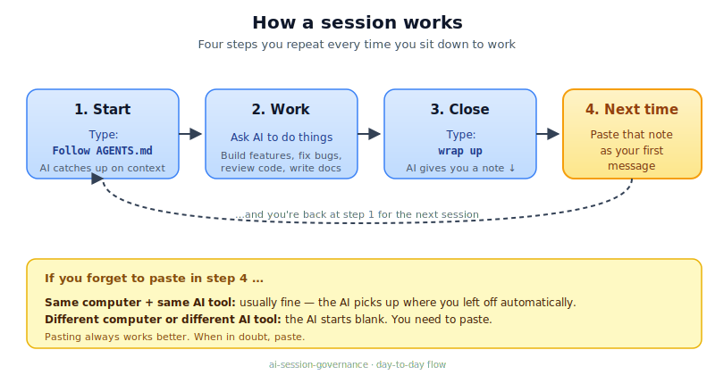
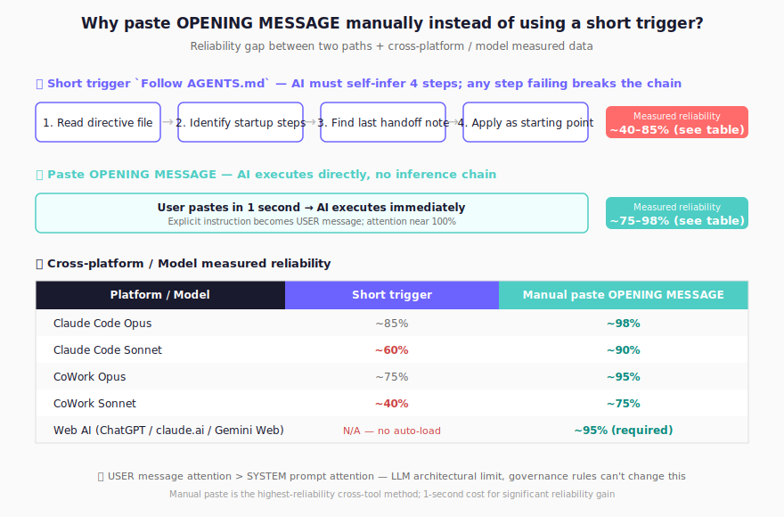

English | [繁體中文](README.zh-TW.md) | [简体中文](README.zh-CN.md) | [日本語](README.ja.md)

# :rocket: Governance Template for Cross-AI Handoff Workflows

When your Codex / Claude / Gemini quota runs out, paste the handoff block into the next AI and it picks up where you left off.

- Handoff works across different AI CLIs
- Standard workflow: `PLAN -> READ -> CHANGE -> QC -> PERSIST`
- Keeps governance from drifting, instead of just adding more rules
- A harness engineering component focused on session continuity

**[How a session works](#quickstart)** · **[Install](#install)** · **[Upgrade](#upgrade)** · **[Quick Operations](#quick-operations)**


> **🆕 First time here?** The **[Interactive Introduction](https://prompt-templates.github.io/ai-session-governance/)** walks you through what this template does in about 5 minutes — recommended before reading the rest of this README.


---

## :bookmark_tabs: Why this exists

With multiple AI tools, handoff is usually what breaks first — not output quality.

Common failure pattern:
- Context resets every time you switch tools
- Fixes pile on top of fixes, rules get messier
- README, handoff docs, and logs stop matching

This template requires:
1. One re-entry path every session
2. One workflow for every task
3. One persistent record before closing

---

## :bookmark_tabs: Built-in safeguards

It also catches a few common AI mistakes:

| Safeguard | What it prevents |
|---|---|
| **PLAN risk grading** | Proceeding with high-risk tasks (≥3 files, ambiguous scope, destructive ops, external systems) before confirming the AI understood correctly — high-risk plans pause for user confirmation |
| **External API Code Safety** | Writing API-calling code from hallucinated endpoint / schema memory; requires doc-verified baseline before coding |
| **Codebase context snapshot** | Relearning tech stack, external services, and key decisions from scratch every session |
| **Test plan governance** | Merging changes without a scenario matrix — expected vs. actual outcomes untracked |
| **Consolidation discipline** | Rule accumulation without checking whether existing rules should be updated first |
| **Doc-sync registry** | Guessing which docs to update after a change — `DOC_SYNC_CHECKLIST.md` maps change category to required updates so AI looks up instead of self-assessing |
| **Session log maintenance** | Session history growing to thousands of lines and consuming AI context window — during closeout, AI applies built-in trigger rules to archive old entries and keep startup context lean |
| **QC fail-path** | AI silently retrying or abandoning failed tests — when tests or builds fail, AI must report what failed, diagnose the cause, and wait for user direction instead of auto-retrying |
| **Closeout ambiguity guard** | Accidentally triggering full session closeout with casual remarks like "thanks, that's all I needed" — AI confirms session-end intent when the expression is ambiguous |
| **Reply behavior governance** | AI replying with disguised open questions, padding choice lists with bad options, asking too many clarifying questions, presenting unverified facts as confirmed, or using internal `§` codes as sentence subjects — §11a (v3.0.3 baseline + v3.0.5 expanded) makes 10 rules mandatory: judgement-first with role-split, prescribed choice format (`🚀 *下一步揀一條*` + A/B/C + `💡 推薦`), ≤3 hypotheses + ≤3 questions per round, `UNVERIFIED` distinct from `NA`, plain-language surface text with counter-examples, reply skeleton (`🔎` highlights → deliverables → body), functional emoji vocabulary (🔎/✅/❌/⚠️/📌/💡/🚀), Output-only mode override, SSOT verbatim alignment, reply register consistency |
| **Full-picture-first plans** | AI dumping multi-file or governance changes as ad-hoc text without showing the end state, deliverables, metrics, acceptance test, and goal link first — §3.5 FPFR (v3.0.5) makes 5 fixed sections + verbatim closing line mandatory whenever ≥2 files / new file / governance change / ≥2-phase plan is on the table; "approve A? approve B?" item-by-item prompts are explicitly prohibited |
| **Patch-only delivery format** | AI delivering code / spec / config changes as walls of regenerated text with no anchor or before/after, making review and rollback hard — §11b (v3.0.5) requires precise anchor outside code blocks, BEFORE / AFTER blocks containing only verbatim text, and a Changelog listing added / removed / renamed / moved items |
| **Cross-rule arbitration** | AI arbitrarily picking between conflicting rules (e.g. "minimal modification" vs "fix the root cause") with no consistent priority — §0c (v3.0.5) sets explicit priority order: verifiable correctness > stability > root-cause > completeness > minimal-modification; items 1-4 always override item 5 |
| **Tooling format hard rules** | AI shipping calculations without showing work, JSON without schema, Mermaid with random direction — §13 (v3.0.5) requires calculation 4-step method (digit-by-digit + sign-before-transpose + steps + verify-by-substitution), JSON schema-first with `null` for missing required fields, Mermaid `flowchart TB` with quoted text labels |

### :small_blue_diamond: How SESSION_LOG.md stays manageable

`dev/SESSION_LOG.md` is read at every session start. In an active project this file can grow to thousands of lines — loading months of history that has no relevance to today's work.

The template handles this with explicit closeout checks (not memory-only rules):

- At closeout, AI checks whether `SESSION_LOG.md` exceeds **400 lines** or contains entries older than **30 days**
- If a trigger is hit, AI archives old entries before writing the new closeout entry
- If no trigger is hit, AI skips archive and writes closeout normally
- Archived entries are moved to `dev/archive/` (never deleted), organized by quarter: `SESSION_LOG_YYYY_QN.md`
- The active log target is ≤ **200 lines** while retaining the 2 most recent sessions
- AI reads only `SESSION_LOG.md` at startup — archive files are not loaded

If you already have a large session log, it is trimmed automatically on the first session close after upgrading. No manual step needed.

---

## :bookmark_tabs: Recent releases

Most recent 5 versions only — see [full release history on GitHub](https://github.com/prompt-templates/ai-session-governance/releases) for older entries.

| Version | What changed | Why it matters |
|---|---|---|
| **v3.0.10** | Worktree sessions just work. If you use `git worktree` with Claude Code (one worktree per branch, one per session, etc.), session startup no longer trips over `dev/SESSION_HANDOFF.md` / `dev/SESSION_LOG.md` not being in the worktree's checkout — the AI now reads them from the main repo instead of failing or creating empty placeholder files in the worktree. Release verification gets the same fix: when you run the QA harness from a worktree, the 2 "failures" that show up are now documented as expected behavior, not bugs you need to chase. Also a small zh-TW polish on the v3.0.8 row to match the formal-written register set in v3.0.9. | If you've ever opened Claude Code in a worktree and watched it scramble for files that don't exist there, this version stops that. Release verification gives the same answer wherever you run it from, and the "wait, are those 2 failures real?" moment goes away. zh-TW reads consistently across recent versions. |
| **v3.0.9** | AI replies now respect the language you write in: when you switch to Chinese (or any non-English language), AI stays in your language without sliding into English mid-sentence, and uses the language consistently across the whole reply (English appears only for proper nouns, established terms with no clean translation, or as parenthetical traceability tags). When AI offers a choice between options, each option's label leads with what the choice means for your work — e.g., "any user clone main immediately picks up the new behavior" instead of "commit + push to main + cut tag". Re-installing on a project that already has wizards / templates no longer skips backing them up — `dev/wizards/playbook.md`, `dev/wizards/README.md`, `dev/templates/spec_template.md`, `dev/templates/runbook_template.md` are now in the install backup list. Most importantly: every session's log no longer carries forward "done" items from the prior session — closeout records only what THIS conversation actually did, and cross-session continuing tasks record the increment, not the cumulative completion. | Replies feel like a colleague writing in your language, not a half-translated paragraph with English fragments stuck in. Choice prompts make the trade-off obvious in the first half-line — you don't read implementation detail to figure out what each option means for your work. Re-installing on a project that already has wizards / templates no longer leaves them without backup. Most importantly: SESSION_LOG no longer drifts every session — old INIT.md users reported repeatedly fixing prior-session done items being copy-pasted into the current session record; that's now hard-stopped by governance, not relying on AI mental tracking. |
| **v3.0.8** | Install flow UX gets sharper: Profile picker's 6 options now show as a clean list (one per line) instead of running together as one paragraph. Setup completion and the optional wizard prompt are now two separate messages — `Governance framework ready` lands first as its own message, the wizard offer follows as a separate message — so it's obvious the wizard reply is optional, not part of finishing setup. The wizard's first question evolves from a single cold ask into a main question + three optional supplements (point me to reference files, URLs, or known decisions if handy), and AI now actively reads what you provide before drafting. Every assumption in the draft is tagged `[from your input]` vs `[my inference]` so you can tell at a glance which came from your input versus which AI estimated. 4 prior Chinese-mixed-into-English defects in INIT.md / AGENTS.md cleaned up. | First-time install no longer confuses users about whether answering the wizard prompt is needed to finish setup. Wizard-driven spec drafts feel grounded — AI reads your reference files / URLs instead of imagining content, and you can spot-check sources without guessing which line is fact vs AI guess. |
| **v3.0.7** | New onboarding wizard system: AI drafts your `PROJECT_MASTER_SPEC.md` or `RUNBOOK.md` from a 1-sentence project description, surfaces every assumption made as a numbered list, and iterates with you until the draft is right — no cold question forms. Replaces a 5-7 step structured Q&A schema that proved too rigid for vague long-term visions. Matrix-QC audit tool gained boundary-aware divergence rules + a prescriptive-verb ban so audit findings stay description-only (the human decides fixes, not the audit). Playbook gained 3 dogfood-tested discipline rules (explicit-write-vs-soft-closure split, hallucination guardrail using `(待補)` for fields without ground truth, explicit per-field assumption surfacing). Landing page now describes the wizard system as a feature card. | First-time users no longer face a blank `PROJECT_MASTER_SPEC.md` template — AI produces a full draft from minimal input, with every assumption surfaced for transparent spot-check. Long-term project visions that don't fit cold question forms are first-class supported. Audit tool no longer cries wolf on intentional install-template-vs-runtime boundaries. Playbook iterations cost fewer redundant round-trips. |
| **v3.0.6** | Closeout UX polish: 6 redesigned session boot/closeout visuals, the "paste this block" caption shortened from 3 lines to 1 line, and README's install/upgrade flow shortened from 9 steps to 5 with a "behind the scenes" callout for AI internals. README's Resume section now explains why pasting the OPENING MESSAGE manually beats relying on `Follow AGENTS.md` (~95% vs ~70-85% reliability). Pre-existing harness exit-code bug (R27-10) patched. | New users get a much shorter, cleaner install flow. Sessions look better at boot/close. The "why paste manually" answer removes a common source of confusion when switching AI tools. |

---

<a id="quickstart"></a>

## :bookmark_tabs: How a session works

After installing once, every session follows the same loop:



### :small_blue_diamond: 5 steps, end-to-end

1. **Install** (one-time): paste **[INIT.md](INIT.md)** into your AI tool, then confirm `INSTALL_ROOT_OK: <absolute_path>` and `INSTALL_WRITE_OK`.
2. **Start a session**: type `Follow AGENTS.md`. AI catches up on what you were doing.
3. **Work**: ask AI to build features, fix bugs, write docs — anything.
4. **Close**: type `wrap up`. AI hands you a **NEXT SESSION OPENING MESSAGE** block.
5. **Next session**: paste that block as your first message — and you're back at step 2 instantly.

> **Forgot to paste in step 5?** Pasting is still the most reliable path — AI's `SESSION_LOG.md` auto-fallback varies from ~40% to ~85% depending on AI tool and model. See [Quick Operations](#quick-operations) §3 "Why paste manually" below for the full breakdown.

---

<a id="install"></a>

## :bookmark_tabs: Install

1. Open the AI tool of your choice (Codex / Claude Code / Claude CoWork / Gemini CLI) at the project folder where you want governance installed.
2. Open **[INIT.md](INIT.md)** → click **Raw** → copy all.
3. Paste into the AI dialog and submit.
4. AI replies asking for two confirmations — reply each on its own line:
   - `INSTALL_ROOT_OK: <absolute_path>`
   - `INSTALL_WRITE_OK`
5. Done — AI prints a **Quick Start** block when finished.

> **Behind the scenes (no action needed):** AI runs a root safety preflight (prints `pwd` + `git root`, stops if they differ so you can choose), shows a dry-run plan (`create` / `merge` / `skip`) before any write, and creates a backup snapshot of any existing governance files at `dev/init_backup/<UTC_TIMESTAMP>/`.

### :small_blue_diamond: Install UI walkthrough

<table>
  <tr>
    <td align="center" width="50%">
      
      <br />
      <sub>Step 1: Paste `INIT.md` into your AI CLI</sub>
    </td>
    <td align="center" width="50%">
      
      <br />
      <sub>Step 2: Review detected roots</sub>
    </td>
  </tr>
  <tr>
    <td align="center" width="50%">
      
      <br />
      <sub>Step 3: Confirm `INSTALL_ROOT_OK`</sub>
    </td>
    <td align="center" width="50%">
      
      <br />
      <sub>Step 4: Confirm `INSTALL_WRITE_OK`</sub>
    </td>
  </tr>
</table>

After step 4, AI creates a backup before writing anything.

### :small_blue_diamond: Real run snapshots

<table>
  <tr>
    <td align="center" width="50%">
      
      <br />
      <sub>Launch: session boot and context loading</sub>
    </td>
    <td align="center" width="50%">
      
      <br />
      <sub>Closeout: session summary and handoff output</sub>
    </td>
  </tr>
</table>

Don't copy the repo manually. Use `INIT.md` — it handles merging safely into your existing files.

**Already installed and want to upgrade?** Same `INIT.md` flow — see [Upgrading](#upgrade) below.

---

<a id="upgrade"></a>

## :bookmark_tabs: Upgrading from a previous version

Same flow as Install — re-run `INIT.md` against the same project root.

1. Open the same AI tool at your installed project folder.
2. Open **[INIT.md](INIT.md)** → click **Raw** → copy all.
3. Paste into the AI dialog and submit.
4. AI replies asking for two confirmations — reply each on its own line:
   - `INSTALL_ROOT_OK: <absolute_path>`
   - `INSTALL_WRITE_OK`
5. Done — AI backs up existing files, merges new governance content, preserves your custom rules.

**Optional safe-upgrade prompt** (paste this before step 3 for extra protection):

```text
Upgrade governance with this INIT.md in merge-only mode.
Do not overwrite, delete, or reset any of my existing custom governance rules/content/files.
Show the dry-run plan first (create/merge/skip), then wait for my confirmations: INSTALL_ROOT_OK and INSTALL_WRITE_OK.
```

> **Behind the scenes (no action needed):** AI backs up existing `AGENTS.md` / `CLAUDE.md` / `GEMINI.md` / `dev/*` files into `dev/init_backup/<UTC_TIMESTAMP>/`, then merges governance sections — your custom content, `dev/DOC_SYNC_CHECKLIST.md` custom rows, and `dev/SESSION_HANDOFF.md` / `dev/SESSION_LOG.md` are all preserved. Works from any previously installed version.

---

<a id="quick-operations"></a>

## :bookmark_tabs: Quick Operations

### :small_blue_diamond: 1) Start a session

```text
Follow AGENTS.md
```

### :small_blue_diamond: 2) Close with full handoff

```text
wrap up
```

### :small_blue_diamond: 3) Resume in another AI CLI

```text
<Paste the previous session's "NEXT SESSION OPENING MESSAGE" block as your first message.>
```

> **Why paste manually instead of just `Follow AGENTS.md`?** Governance is designed so AI auto-reads your saved handoff from `SESSION_LOG.md` — that's the self-contained intent. In practice, the short `Follow AGENTS.md` trigger reliability varies widely by AI tool and model: Claude Code Opus ~85%, Claude Code Sonnet ~60%, CoWork Opus ~75%, CoWork Sonnet ~40%. The OPENING MESSAGE block is a longer explicit prompt — its first two lines anchor the receiving AI to read all 4 governance files in order, pushing reliability to ~75-98% across the same matrix. One extra paste removes the guesswork. When in doubt, paste.



### :small_blue_diamond: 4) Build a starter project spec or runbook (guided wizard)

```text
build master spec
```

(or `build runbook` for a recurring procedure runbook)

> **What it does:** Give AI a 1-sentence description of your project (or recurring procedure). AI generates a one-shot full draft with all fields filled + a numbered list of every assumption it made. You spot-check, point at items to correct (by index or free-form), AI re-drafts. When the draft looks right, AI proposes writing it to `dev/PROJECT_MASTER_SPEC.md` (or `dev/RUNBOOK.md`). Designed for vague long-term project visions where cold question forms feel like an interrogation. Behavior lives in `dev/wizards/playbook.md`; field structure lives in `dev/templates/spec_template.md` + `dev/templates/runbook_template.md` (both standalone-fillable without AI). The wizard also auto-fires once at first install (POST-INSTALL: Profile Selection step in `INIT.md`) so first-time users don't need to know the wizard exists.

---

## :bookmark_tabs: Quota-switch handoff flow

1. Work in CLI-A until quota is near limit
2. Ask for closeout and copy the generated handoff block
3. Open CLI-B and paste the block unchanged
4. CLI-B continues from the same baseline using `SESSION_HANDOFF.md` + `SESSION_LOG.md`

This is the primary design target of this repo.

---

## :bookmark_tabs: Platform setup

`AGENTS.md` is the single governance source of truth. `CLAUDE.md` and `GEMINI.md` are thin pointers.

| Platform | Native file | What ships | Existing file action |
|---|---|---|---|
| **Codex** | `AGENTS.md` | full governance rules | merge governance sections |
| **Claude Code** | `CLAUDE.md` | pointer: `@AGENTS.md` | prepend `@AGENTS.md` |
| **Gemini CLI** | `GEMINI.md` | pointer: `@./AGENTS.md` | prepend `@./AGENTS.md` |

> **Codex users:** AGENTS.md exceeds the default 32 KiB context limit. Add `project_doc_max_bytes = 49152` to `~/.codex/config.toml` to load the full file.

---

## :bookmark_tabs: 3 scenarios

### :small_blue_diamond: Scenario 1 — Quota exhausted, switch AI and continue
You hit quota in one CLI and must switch immediately.  
This template preserves baseline, pending tasks, risks, and validation state so work continues without re-explaining context.

### :small_blue_diamond: Scenario 2 — One repo, multiple AI agents
Different agents handle code, docs, and infra.  
Shared handoff/log discipline prevents parallel reality drift.

### :small_blue_diamond: Scenario 3 — Long-lived repo with governance drift
Fixes keep accumulating and docs diverge.  
Consolidation-before-adding rules reduce SOP sprawl and maintenance cost.

---

## :bookmark_tabs: FAQ

For a visual walkthrough of common questions, see the **[Interactive Introduction](https://prompt-templates.github.io/ai-session-governance/)**.

### :small_blue_diamond: 1) Is this only for large projects?
No. Small repos benefit right away; larger ones see more gain over time.

### :small_blue_diamond: 2) Do I need `PROJECT_MASTER_SPEC.md` on day one?
No. Start with `AGENTS.md` + `SESSION_HANDOFF.md` + `SESSION_LOG.md`. When you want one later, just say `build master spec` — AI drafts it from a 1-sentence project description (v3.0.7+).

### :small_blue_diamond: 3) Is this a coding style guide?
No. It governs how AI reads, changes, verifies, and hands over work — not how you write code.

### :small_blue_diamond: 4) Will this slow sessions down?
There's a short read at startup. Usually less overhead than re-explaining context and redoing mistakes.

### :small_blue_diamond: 5) Can I keep my existing docs and internal rules?
Yes. It merges with what you already have — it doesn't overwrite things.

### :small_blue_diamond: 6) When is this overkill?
If you're asking a quick question, doing one-off research, or running a single session you won't come back to — skip this. The startup reads and closeout writes add overhead that only pays off when you'll return to the same project across multiple sessions.

This template was built for ongoing development work: codebases you'll touch again tomorrow, repos where multiple AI tools take turns, projects where "what did we decide last week" actually matters. If your workflow doesn't involve files that change over time, the PLAN→READ→CHANGE→QC→PERSIST cycle has nothing to wrap around.

---

## :bookmark_tabs: Repository source layout

```text
<PROJECT_ROOT>/
├─ INIT.md
├─ AGENTS.md
├─ CLAUDE.md
├─ GEMINI.md
├─ docs/
│  └─ ...
└─ dev/
   ├─ SESSION_HANDOFF.md
   ├─ SESSION_LOG.md
   ├─ archive/                 # auto-archived log entries (quarterly)
   ├─ DOC_SYNC_CHECKLIST.md    # doc-sync registry
   ├─ CODEBASE_CONTEXT.md      # auto-generated first session
   ├─ wizards/                 # guided wizard playbook (v3.0.7+)
   ├─ templates/               # spec / runbook field templates (v3.0.7+)
   ├─ PROJECT_MASTER_SPEC.md   # optional (build via `build master spec`)
   └─ RUNBOOK.md               # optional (build via `build runbook`)
```

### :small_blue_diamond: Core files

- `INIT.md` - bootstrap prompt (public entry point)
- `AGENTS.md` - governance source of truth
- `CLAUDE.md` - Claude pointer to SSOT
- `GEMINI.md` - Gemini pointer to SSOT
- `dev/SESSION_HANDOFF.md` - current baseline and next priorities
- `dev/SESSION_LOG.md` - session-by-session history and validation (rolling window, auto-trimmed)
- `dev/archive/` - auto-archived session log entries, organized by quarter; not read at startup
- `dev/DOC_SYNC_CHECKLIST.md` - doc-sync registry: maps change category to required doc updates
- `dev/CODEBASE_CONTEXT.md` - tech stack, external services, key decisions (auto-generated first session)
- `dev/wizards/playbook.md` - guided wizard behavior rules (v3.0.7+; AI-assisted spec / runbook drafting)
- `dev/wizards/README.md` - wizard system overview pointer
- `dev/templates/spec_template.md` - field structure for `PROJECT_MASTER_SPEC.md`
- `dev/templates/runbook_template.md` - field structure for `RUNBOOK.md`
- `dev/PROJECT_MASTER_SPEC.md` - optional long-term authority (build via `build master spec` wizard)
- `dev/RUNBOOK.md` - optional recurring-procedure runbook (build via `build runbook` wizard)

---

## :bookmark_tabs: Governance principles

1. Read before change
2. Triage before debug
3. Consolidate before adding
4. Verify before claiming done
5. Persist before leaving

---

## :bookmark_tabs: Verification

Full verification details:
- [docs/VERIFICATION.md](docs/VERIFICATION.md)
- Latest QA regression report: [docs/qa/LATEST.md](docs/qa/LATEST.md)

Snapshot status (as of 2026-05-08 — v3.0.10):
- AGENTS/INIT rule parity: verified (356-check automated regression — 267 main + 89 legacy auto-chain)
- AGENTS.md governance scope: 530 → 687 lines (+29.6%) at v3.0.5 Tier 2 integration; v3.0.6 visual cue refresh + hint simplification line-count-neutral; cumulative −6.4% vs v2.x baseline (734); all rules + 331 grep-anchors preserved (212 baseline + R29×12 + R30×6 + entry-cap×3 + reply-behavior×6 + R31×17 + R32×34 + R33×41)
- Sandbox install QC: 3 HIGH-risk scenarios PASS (re-install with user overflow files / §5a `pwd ≠ git root` mismatch / §4 closeout end-to-end)
- Matrix QC audit (10-dimension) on sandbox install: PASS (LOW finding from rc.1 resolved by rc.2 hotfix)
- Handoff efficiency validation: still valid (30-scenario matrix from v2.7; required handoff fields preserved while startup payload decreased)
- Multi-platform pointer behavior: verified

---

## :bookmark_tabs: Deep docs

If this repo grows, recommended companion docs:
- `dev/PROJECT_MASTER_SPEC.md`
- `docs/OPERATIONS.md`
- `docs/POSITIONING.md`

Current minimum:
- `AGENTS.md`
- `dev/SESSION_HANDOFF.md`
- `dev/SESSION_LOG.md`

---

## :bookmark_tabs: Designer

> Designed by **[Adam Chan](https://www.facebook.com/chan.adam)** · [i.adamchan@gmail.com](mailto:i.adamchan@gmail.com)
>
> *Built for the Vibe Coding era — everyone deserves to shape their own AI-powered world.*

---

## :bookmark_tabs: License

Use, adapt, and extend for your workflows.
