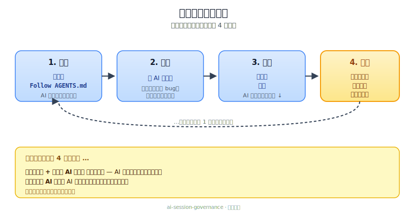
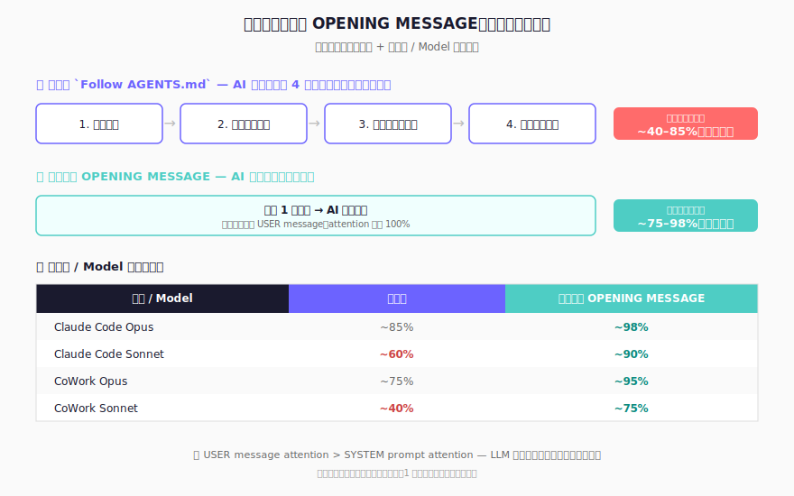

[English](README.md) | [繁體中文](README.zh-TW.md) | 简体中文 | [日本語](README.ja.md)

# :rocket: 支持跨 AI 工具交接的开发治理模板

当 Codex、Claude 或 Gemini 的配额用尽，把交接区块贴到下一个工具，它就能从同样的状态继续，不用重新说明。

- 跨命令行工具交接
- 统一工作流程：`PLAN -> READ -> CHANGE -> QC -> PERSIST`
- 防止治理规则漂移，而不是一直叠加新规则
- 一个专注于 session 连续性的 Harness Engineering 组件

**[工作阶段如何运作](#quickstart)** · **[安装](#install)** · **[升级](#upgrade)** · **[快速操作](#quick-operations)**


> **🆕 初次接触？** 建议先花 5 分钟看 **[互动式介绍页面](https://prompt-templates.github.io/ai-session-governance/?lang=cn)** — 以可视化方式了解本模板的功能与设计理念，再阅读本 README 其余章节。


---

## :bookmark_tabs: 为什么要做这个

用多个 AI 工具开发时，最先出问题的通常是交接，不是生成质量。

常见失败模式：
- 每次切换工具都要重头说明
- 修复叠在修复上，规则越来越乱
- 说明文档、交接文档、日志慢慢对不上

本模板规定：
1. 每个工作阶段只有一条重入路径
2. 每项任务走同一套工作流程
3. 每次收尾前必须留下可追溯的记录

---

## :bookmark_tabs: 内置防护机制

也涵盖几个常见的 AI 失误：

| 防护机制 | 防止什么 |
|---|---|
| **PLAN 风险分级** | 高风险任务（≥3 文件、范围不明、破坏性操作、外部系统）在 AI 确认理解正确前不会自动开始 — 高风险计划暂停等用户确认 |
| **外部 API 代码安全** | 根据训练记忆臆测端点 / 参数 / Schema 并直接写入 API 调用代码 |
| **代码库上下文快照** | 每次工作阶段切换后 AI 重新从零摸索技术栈、外部服务与关键决策 |
| **测试计划治理** | 合并变更时未记录情景矩阵 — 预期结果与实际结果未被追踪 |
| **整合纪律** | 持续叠加规则，却未先确认既有规则是否已涵盖或应更新 |
| **文档同步注册表** | 变更后猜测要更新哪些文档 — `DOC_SYNC_CHECKLIST.md` 将变更类别映射到必要更新项，AI 查表而非自行判断 |
| **工作日志自动维护** | 工作日志随时间增长到数千行，占用 AI 每次启动的 context — 收尾时由 AI 按触发条件自动整理旧记录，保持启动上下文精简 |
| **QC 失败处理** | AI 静默重试或放弃失败的测试 — 测试或构建失败时，AI 必须报告失败内容、诊断原因，并等待用户指示，而非自动重试 |
| **收尾误触保护** | 「好了谢谢」之类的日常用语意外触发完整 session closeout — 当语意模糊时，AI 会先确认是否真的要结束工作阶段 |
| **回复行为治理** | AI 用假装开放题反问推回用户、选项夹差选项充数、过量澄清问题、未核对 facts 当已核对写、surface text 用 `§` codes 做句子主语 — §11a（v3.0.3 baseline + v3.0.5 扩展）令 10 条 reply rules mandatory：judgement-first 加角色分工、规定选择题格式（`🚀 *下一步揀一條*` + A/B/C + `💡 推薦`）、≤3 假设 + ≤3 问题、`UNVERIFIED` 与 `NA` 区分、surface text 用人话加反例正例、回复骨架（`🔎` 重点 → 交付清单 → 正文）、功能 emoji 词汇（🔎/✅/❌/⚠️/📌/💡/🚀）、Output-only mode override、SSOT 逐字对齐、回复语体一致 |
| **全图优先计划** | AI 将多档或治理改动当散文堆，无 end-state、无交付、无指标、无验收、无目标连结 — §3.5 FPFR（v3.0.5）规定：当涉及 ≥2 档 / 新建档 / 治理改动 / ≥2 阶段计划时，必须以 5 个固定区段 + 收尾句呈交；明禁「同意 A？同意 B？」逐项批准 |
| **补丁式交付格式** | AI 将代码 / spec / 设定改动当整段重生文字交，无 anchor、无 before/after，难审难 rollback — §11b（v3.0.5）规定：精准 anchor 在 code block 外、BEFORE / AFTER 两个 code block 内只放 verbatim 文字、Changelog 列出 added / removed / renamed / moved |
| **跨规则仲裁** | AI 对住规则冲突（例如「最小改动」vs「根因治理」）随机选，无一致优先序 — §0c（v3.0.5）明文优先序：事实可验收 > 稳定性 > 根因治理 > 完整性交付 > 最小改动；前 4 项永远 override 第 5 项 |
| **工具格式硬规则** | AI 计算不展示步骤、JSON 无 schema、Mermaid 方向乱 — §13（v3.0.5）规定：计算四步法（逐位 + 判正负 + 显示步骤 + 代回验算）、JSON schema-first 必填栏位用 `null`、Mermaid `flowchart TB` 方向加 `"..."` 包覆 text label |

### :small_blue_diamond: SESSION_LOG.md 怎么保持精简

`dev/SESSION_LOG.md` 在每次工作阶段启动时都会被读取。在活跃的项目中，这个文件可能增长到数千行——把几个月前已无关的历史记录全部载入 AI 的 context。

本模板通过“明确收尾检查”处理（不是只靠规则记忆）：

- 收尾时 AI 会检查：`SESSION_LOG.md` 是否超过 **400 行**，或是否存在超过 **30 天**的旧记录
- 命中触发条件时，AI 先归档旧记录，再写入本次收尾
- 未命中触发条件时，AI 跳过归档，直接写入收尾
- 旧记录移动到 `dev/archive/`（不删除），并按季度整理为 `SESSION_LOG_YYYY_QN.md`
- 主日志目标维持在 ≤ **200 行**，并保留最近 2 个工作阶段
- AI 启动时只读 `SESSION_LOG.md`，归档文件不会被载入

若你已有一个庞大的工作日志，在升级后第一次工作阶段收尾时会自动整理，不需要手动操作。

---

## :bookmark_tabs: 近期版本

仅显示最近 5 个版本 — 较旧版本详见 [GitHub 完整 release 历史](https://github.com/prompt-templates/ai-session-governance/releases)。

| 版本 | 变更内容 | 对你的意义 |
|---|---|---|
| **v3.0.6** | 收尾界面优化：6 款重新设计的工作阶段启动/收尾视觉、「粘贴此区块」说明从 3 行缩为 1 行、README 安装/升级流程从 9 步缩为 5 步并加上「AI 背后执行」说明区块。README 接续区段首次解释为何手动粘贴 OPENING MESSAGE 比 `Follow AGENTS.md` 更可靠（约 95% vs 约 70-85%）。修补既有 harness exit code 漏洞（R27-10）。 | 新用户安装流程大幅精简。工作阶段启动/收尾画面更美观。「为何手动粘贴」的解释消除常见困惑。 |
| **v3.0.5** | 完整回复协议现入治理，不再只是「universal subset」。回复会先用 `🔎` 重点 bullet（≤3 行）、再交付清单、再正文。选择题用一致格式 `🚀 *下一步揀一條*` + A/B/C + `💡 推薦`。多档或治理改动触发全图优先计划，5 个固定区段（END-STATE / DELIVERABLES / METRICS / ACCEPTANCE / GOAL LINK）+ 收尾句 — 不再有「同意 A？同意 B？」逐项批准。代码 / spec / 设定改动以补丁交付：精准 anchor 在 code block 外、BEFORE / AFTER 两个 code block 内只放 verbatim 文字、加 Changelog。数值答案展示四步。JSON 先定 schema。Mermaid 用 `flowchart TB` 加 `"..."` 包覆 text label。当两条规则冲突时 AI 依明文优先序（事实可验收 > 稳定性 > 根因 > 完整性 > 最小改动），不再随机选择。 | 回复体验一致、可扫读：顶置重点 → 清单 → 正文，surface text 不再夹杂 `§` codes。非 trivial 工作的计划永远是全图优先，所以你可以一眼 veto / 修改整个 plan，无需逐项批准。Patch 易审可贴。仲裁规则令 AI 不再为「diff 较小」牺牲事实可验收 — 事实可验收永远胜出。 |
| **v3.0.4** | 每次工作阶段结束时 AI 给你的那段字条，现在标题改为「NEXT SESSION OPENING MESSAGE」，并在底下加一行提示「贴成你下次 AI 工作阶段的第一条消息」— 看到就知道要贴去哪。工作阶段开始时 AI 会打印一行 `Seed context: ...` 显示用了哪个来源（你贴的、或者自动读取上次留下的字条），让你看清楚有没有接续到。README 不再只教安装 + 开始，现在覆盖完整每日流程（开始 → 工作 → 结束 → 下次接续），并附 4 个语言版本的视觉流程图。release notes 改用新模板，每篇都先讲「对你的意义」，不再像内部 changelog。 | 工作阶段结尾不再困惑「这段字条要贴去哪」。AI 启动时不用再猜「它有没有接续上次」。新用户读 README 就看到整个日常流程，不只是安装。 |
| **v3.0.3** | AI 回复变得更果断直接：当 AI 有判断时会直接给出，不再用「你觉得呢」反问把决定推回给你。选项最多 3 个并附上明确推荐。AI 未核对过的数字、日期、引用会明确标示 `UNVERIFIED`，让你一眼分辨已核实 vs 未核实。内部规则代码不再用作回复里的句子主语。每条 SESSION_LOG 收尾记录上限 ≤110 行，发布版本相关的详细内容会移到另一个文件，避免每次启动读取时被旧记录拖慢。 | 简单任务减少来回确认。已核实 vs 未核实的状态看得清楚。阅读回复不再需要先懂治理术语。长期项目启动速度不会被历史记录拖慢。 |
| **v3.0**（含 v3.0.1 / v3.0.2 patches） | 治理文档大幅精简：AGENTS.md 从 734 行缩减至 504 行（−31.3%），所有规则完整保留；每 session 启动的系统 prompt token 成本下降约 15.6%。Legacy quarantine 机制把 89 条历史防漂移检查隔离到自动 chain 的第二层 harness — 主检查套件变轻，但 release 时禁止 bypass legacy，历史保险不会无声丢失。v3.0.1 加入 release 后文档同步治理（R29 系列检查），防止 README / index.html 漂走。v3.0.2 把 release / merge gate 扩充为 4 阶段生命周期（发前验证 / 发 release / 发后执手尾 / 观察期），加 R30 系列 enforcement。已创建 `dev/SESSION_STATE_DETAIL.md` 或 `dev/PROJECT_MASTER_SPEC.md` 的用户 re-install 时也会被自动备份，升级路径数据安全。 | 系统 prompt 中的治理文本变少 → 规则遵守率提升（业界数据：短规则约 89% vs 冗长约 35%）；release 后相关文件漂走会自动 catch（README、release notes、公开页 stat counter 同步）；本地文件在升级时被保留；跨 LLM 通用兼容（Claude Code、Claude Cowork、OpenAI Codex CLI、Gemini CLI 与 Web LLMs）— 零 hook 依赖。 |

---

<a id="quickstart"></a>

## :bookmark_tabs: 工作阶段如何运作

安装一次之后，每次工作阶段都重复同一个循环：



### :small_blue_diamond: 5 步走完一次完整流程

1. **安装**（一次性）：将 **[INIT.md](INIT.md)** 粘贴到你的 AI 工具，按提示回复 `INSTALL_ROOT_OK: <absolute_path>` 与 `INSTALL_WRITE_OK`。
2. **开始工作阶段**：输入 `Follow AGENTS.md`，AI 会接续你上次的进度。
3. **工作**：让 AI 开发功能、修 bug、写文档 — 任何事都可以。
4. **结束**：输入 `收工`。AI 会给你一张 **NEXT SESSION OPENING MESSAGE** 字条。
5. **下次工作阶段**：把那张字条粘贴成你的第一条消息 — 就回到步骤 2 了。

> **忘了在步骤 5 粘贴字条？** 粘贴仍是最可靠做法 — AI 自动读取 `SESSION_LOG.md` 的可靠度视 AI 工具与 model 而定，由约 40% 至 85% 不等。详见下方[快速操作](#quick-operations) §3「为何要手动粘贴」的解说。

---

<a id="install"></a>

## :bookmark_tabs: 安装

1. 在你想安装治理规则的项目文件夹，打开你选择的 AI 工具（Codex / Claude Code / Claude CoWork / Gemini CLI）。
2. 打开 **[INIT.md](INIT.md)** → 点击 **Raw** → 全选复制。
3. 粘贴到 AI 对话框并提交。
4. AI 会请你回复两项确认，每项分行回复：
   - `INSTALL_ROOT_OK: <absolute_path>`
   - `INSTALL_WRITE_OK`
5. 完成 — AI 会输出 **Quick Start** 区块作为操作参考。

> **AI 在背后执行的步骤（无需手动操作）：** AI 执行根目录安全预检（显示 `pwd` + `git root`，若不一致则停止让你选择），在写入前显示演练计划（`create` / `merge` / `skip`），并将已有治理文件备份至 `dev/init_backup/<UTC_TIMESTAMP>/`。

### :small_blue_diamond: 安装流程界面

<table>
  <tr>
    <td align="center" width="50%">
      
      <br />
      <sub>步骤 1：将 `INIT.md` 粘贴到 AI 命令行工具</sub>
    </td>
    <td align="center" width="50%">
      
      <br />
      <sub>步骤 2：确认检测到的根目录</sub>
    </td>
  </tr>
  <tr>
    <td align="center" width="50%">
      
      <br />
      <sub>步骤 3：回复 `INSTALL_ROOT_OK`</sub>
    </td>
    <td align="center" width="50%">
      
      <br />
      <sub>步骤 4：回复 `INSTALL_WRITE_OK`</sub>
    </td>
  </tr>
</table>

完成步骤 4 确认后，AI 在写入任何文件前会先创建备份。

### :small_blue_diamond: 实际执行界面

<table>
  <tr>
    <td align="center" width="50%">
      
      <br />
      <sub>启动：工作阶段开机与上下文加载</sub>
    </td>
    <td align="center" width="50%">
      
      <br />
      <sub>收尾：工作阶段摘要与交接输出</sub>
    </td>
  </tr>
</table>

AI 自动处理并合并已有的 `AGENTS.md`、`CLAUDE.md`、`GEMINI.md`。
大多数情况下，直接使用 `INIT.md` 就够了。
不要手动复制整个仓库，用 `INIT.md` 安装才能安全合并。

**已安装并想升级？** 同样运行 `INIT.md` — 详见下方[从旧版升级](#upgrade)。

---

<a id="upgrade"></a>

## :bookmark_tabs: 从旧版升级

与安装流程相同 — 对同一个项目根目录重新运行 `INIT.md`。

1. 在已安装的项目文件夹打开同一个 AI 工具。
2. 打开 **[INIT.md](INIT.md)** → 点击 **Raw** → 全选复制。
3. 粘贴到 AI 对话框并提交。
4. AI 会请你回复两项确认，每项分行回复：
   - `INSTALL_ROOT_OK: <absolute_path>`
   - `INSTALL_WRITE_OK`
5. 完成 — AI 备份现有文件、合并新治理内容、保留你的自定义规则。

**安全升级提示语**（如需额外保护，于步骤 3 之前粘贴）：

```text
请用这份 INIT.md 执行治理升级，只做 merge 整合。
不得覆盖、删除或重置我现有的自定义 governance 规则/内容/文件。
请先显示 dry-run 计划（create/merge/skip），再等待我确认 INSTALL_ROOT_OK 与 INSTALL_WRITE_OK。
```

> **AI 在背后执行的步骤（无需手动操作）：** AI 将现有 `AGENTS.md` / `CLAUDE.md` / `GEMINI.md` / `dev/*` 文件备份至 `dev/init_backup/<UTC_TIMESTAMP>/`，然后合并治理章节 — 你的自定义内容、`dev/DOC_SYNC_CHECKLIST.md` 自定义行、`dev/SESSION_HANDOFF.md` / `dev/SESSION_LOG.md` 全部保留。可从任何已安装版本升级。

---

<a id="quick-operations"></a>

## :bookmark_tabs: 快速操作

以下句子可直接复制粘贴。

### :small_blue_diamond: 1) 开始新工作阶段

```text
Follow AGENTS.md
```

### :small_blue_diamond: 2) 收尾并完成完整交接

```text
收工
```

### :small_blue_diamond: 3) 快速开始下一个工作阶段

```text
<将上一轮输出的“NEXT SESSION OPENING MESSAGE”区块粘贴作为下次会话的第一条消息。>
```

> **为何要手动粘贴，而非依赖 `Follow AGENTS.md` 短指令？** 治理设计本身是 self-contained — AI 应自动读取上次留下的 handoff。然而实际测试显示 `Follow AGENTS.md` 短指令的可靠度因 AI 工具与 model 而异：Claude Code Opus 约 85%、Claude Code Sonnet 约 60%、CoWork Opus 约 75%、CoWork Sonnet 约 40%。OPENING MESSAGE 区块是明文指令 — 开头两行明确指示 AI 依序读取 4 个治理档，同一矩阵下可靠度提升至约 75–98%。多粘贴一次即可消除不确定性。如有疑虑，请粘贴。



---

## :bookmark_tabs: 配额切换交接流程

1. 在命令行工具 A 的配额即将耗尽前，先完成本次收尾
2. 复制 `NEXT SESSION HANDOFF PROMPT (COPY/PASTE)` 区块
3. 在命令行工具 B 原文粘贴，不要改动内容
4. 工具 B 会依据 `SESSION_HANDOFF.md` 与 `SESSION_LOG.md` 接续执行

这是本仓库的核心设计目标。

---

## :bookmark_tabs: 平台设置

`AGENTS.md` 为治理规则的单一真实来源；`CLAUDE.md` 与 `GEMINI.md` 为薄型指针文件。

| 平台 | 原生文件 | 预设提供 | 若你已有该文件 |
|---|---|---|---|
| **Codex** | `AGENTS.md` | `AGENTS.md`（完整规则） | 将治理章节合并到已有文件 |
| **Claude Code** | `CLAUDE.md` | 指针文件：`@AGENTS.md` | 在已有 `CLAUDE.md` **最上方**加入 `@AGENTS.md` |
| **Gemini CLI** | `GEMINI.md` | 指针文件：`@./AGENTS.md` | 在已有 `GEMINI.md` **最上方**加入 `@./AGENTS.md` |

> **Codex 用户：** AGENTS.md 超过默认 32 KiB context 上限。请在 `~/.codex/config.toml` 中添加 `project_doc_max_bytes = 49152` 以加载完整文件。

---

## :bookmark_tabs: 3 种场景

### :small_blue_diamond: 场景 1 — 一个 AI 工具用尽配额，切换另一个工具续做
当你在某个命令行工具用尽配额时，可能需要立即切换到另一个工具。  
本模板可保留基线、待办、风险与验证状态，避免重述上下文。

### :small_blue_diamond: 场景 2 — 一个仓库，多个 AI 工具协作
例如由 Codex 编写代码、Claude 处理文档、Gemini 协助调试基础设施。  
通过共用交接文档与工作日志，可避免各工具对项目状态产生分歧。

### :small_blue_diamond: 场景 3 — 长期项目治理开始漂移
修复逐步累积、规则持续扩张、文档彼此矛盾。  
“先整合、后新增”可降低 SOP 膨胀与长期维护成本。

---

## :bookmark_tabs: 常见问题

可视化常见问题解答请见 **[互动式介绍页面](https://prompt-templates.github.io/ai-session-governance/?lang=cn)**。

### :small_blue_diamond: 1) 这只适合大型项目吗？
不是。小型项目马上就有效果；大型项目时间拉长效益更明显。

### :small_blue_diamond: 2) 第一天就需要 `PROJECT_MASTER_SPEC.md` 吗？
不用。先用 `AGENTS.md` + `SESSION_HANDOFF.md` + `SESSION_LOG.md` 就够了。

### :small_blue_diamond: 3) 这是编码标准吗？
不是。它规范 AI 怎么读、改、验证、交接——不管你怎么写代码。

### :small_blue_diamond: 4) 这会拖慢 AI 吗？
开始时有一点读取时间，通常比重复交代情况和修正错误省时。

### :small_blue_diamond: 5) 我已经有 README、既有文档与内部规则，仍然适用吗？
可以。它会跟你现有的合并，不会覆盖掉。

### :small_blue_diamond: 6) 什么时候不需要用这个？
如果你只是问一个问题、做一次性研究、或跑一个不会再回来的 session — 不用装这个。启动时要读文件、收尾时要写文件，这些 overhead 只有在你会跨多个 session 回到同一个项目时才值得。

这套模板是为持续进行的开发工作设计的：明天还会碰的 codebase、多个 AI 工具轮流上的 repo、「上周我们决定了什么」这句话真的很重要的项目。如果你的工作不涉及随时间变化的文件，PLAN→READ→CHANGE→QC→PERSIST 流程没有东西可以包住。

## :bookmark_tabs: 此仓库原始布局

```text
<PROJECT_ROOT>/
├─ INIT.md
├─ AGENTS.md
├─ CLAUDE.md
├─ GEMINI.md
├─ docs/
│  └─ ...
└─ dev/
   ├─ SESSION_HANDOFF.md
   ├─ SESSION_LOG.md
   ├─ archive/                 # 自动归档的旧记录（按季度）
   ├─ DOC_SYNC_CHECKLIST.md    # 文档同步注册表
   ├─ CODEBASE_CONTEXT.md      # 首次工作阶段自动生成
   └─ PROJECT_MASTER_SPEC.md   # 可选
```

### :small_blue_diamond: 核心文件

- `INIT.md` - 创建/合并治理文件的启动提示（公开入口）
- `AGENTS.md` - 治理单一真实来源
- `CLAUDE.md` - Claude 指针文件
- `GEMINI.md` - Gemini 指针文件
- `dev/SESSION_HANDOFF.md` - 当前基线与下一步优先事项
- `dev/SESSION_LOG.md` - 逐工作阶段历史与验证结果（rolling window，自动整理）
- `dev/archive/` - 自动归档的旧工作日志，按季度整理；启动时不读取
- `dev/DOC_SYNC_CHECKLIST.md` - 文档同步注册表：将变更类别映射到必须更新的文档
- `dev/CODEBASE_CONTEXT.md` - 技术栈、外部服务、关键决策（首次工作阶段自动生成）
- `dev/PROJECT_MASTER_SPEC.md` - 可选的长期权威规格

---

## :bookmark_tabs: 本模板背后的治理原则

1. 修改前先阅读
2. 调试前先分类
3. 新增前先整合
4. 宣称完成前先验证
5. 离开前先持久化

---

## :bookmark_tabs: 验证记录

完整声明对照与平台验证请见：
- [docs/VERIFICATION.md](docs/VERIFICATION.md)
- 最新 QA 回归验收报告： [docs/qa/LATEST.md](docs/qa/LATEST.md)

截至 2026-05-01（v3.0.6）的摘要如下：
- AGENTS/INIT 规则同步：已验证（315 项自动化回归 — 226 主 + 89 legacy auto-chain）
- AGENTS.md governance 范围：530 → 687 行（+29.6%）为 v3.0.5 Tier 2 整合；v3.0.6 视觉更新与措辞简化对行数中性；累计 −6.4% 对比 v2.x baseline (734)；所有规则与 290 个 grep-anchor 完整保留（212 baseline + R29×12 + R30×6 + entry-cap×3 + reply-behavior×6 + R31×17 + R32×34）
- Sandbox 安装实战验收：3 个 HIGH 风险场景 PASS（含 user 自建文件的 re-install / §5a `pwd ≠ git root` mismatch / §4 closeout 端到端）
- Matrix QC 10 维审计（sandbox install）：PASS（rc.1 的 LOW finding 已由 rc.2 hotfix 解除）
- 交接效率验证：仍有效（v2.7 的 30 组场景矩阵；在保留必要交接字段下，启动 payload 明显下降）
- 多平台指针文件行为：已验证

---

## :bookmark_tabs: 深度文档

若本仓库后续扩大，建议补充以下文档：

- `dev/PROJECT_MASTER_SPEC.md` — 完整架构、工作流程、发布、操作手册权威
- `docs/OPERATIONS.md` — 面向操作者的使用与维护程序
- `docs/POSITIONING.md` — 本模板的用途、非用途与定位

若上述文件尚不存在，当前最小需求仍为：

- `AGENTS.md`
- `dev/SESSION_HANDOFF.md`
- `dev/SESSION_LOG.md`

---

## :bookmark_tabs: 设计者

> 由 **[Adam Chan](https://www.facebook.com/chan.adam)** 设计 · [i.adamchan@gmail.com](mailto:i.adamchan@gmail.com)
>
> *Vibe Coding 的时代，人人都能打造属于自己的 AI 世界。*

---

## :bookmark_tabs: 许可

可自由使用、改编与扩展到你的工作流程中。
若你有改进，欢迎回馈可降低漂移且不增加复杂度的做法。
