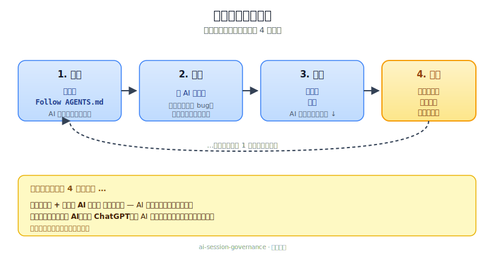
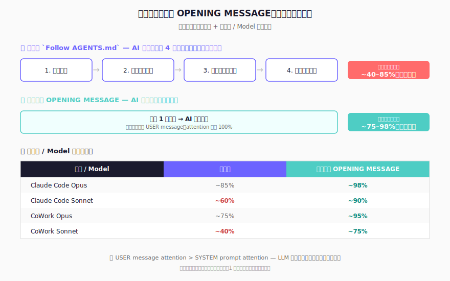

** [全新獨立版本 : https://github.com/Adamchanadam/agent-handoff-kit] ； 新舊版本不兼容數據轉換，建議使用 AGENT Handoff Kit 新版**

[English](README.md) | 繁體中文 | [简体中文](README.zh-CN.md) | [日本語](README.ja.md)

# :rocket: 支援跨 AI 工具交接的開發治理範本

當 Codex、Claude 或 Gemini 的配額用盡，把交接區塊貼到下一個工具，它就能從同樣的狀態繼續，不用重新說明。

- 跨命令列工具交接
- 統一工作流程：`PLAN -> READ -> CHANGE -> QC -> PERSIST`
- 防止治理規則漂移，而不是一直疊加新規則
- 一個專注於 session 連續性的 Harness Engineering 組件

**[工作階段如何運作](#quickstart)** · **[安裝](#install)** · **[升級](#upgrade)** · **[快速操作](#quick-operations)**


> **🆕 初次接觸？** 建議先花 5 分鐘看 **[互動式介紹頁面](https://prompt-templates.github.io/ai-session-governance/?lang=tw)** — 以視覺化方式了解本範本的功能與設計理念，再閱讀本 README 其餘章節。


---

## :bookmark_tabs: 為什麼要做這個

用多個 AI 工具開發時，最先壞掉的通常是交接，不是生成品質。

常見失敗模式：
- 每次切換工具都要重頭說明
- 修復疊在修復上，規則越來越亂
- 說明文件、交接文件、工作日誌慢慢對不上

本範本規定：
1. 每個工作階段只有一條重入路徑
2. 每項任務走同一套工作流程
3. 每次收尾前必須留下可追溯的記錄

---

## :bookmark_tabs: 內建防護機制

也涵蓋幾個常見的 AI 失誤：

| 防護機制 | 防止什麼 |
|---|---|
| **PLAN 風險分級** | 高風險任務（≥3 檔案、範圍不明、破壞性操作、外部系統）在 AI 確認理解正確前不會自動開始 — 高風險計劃暫停等用戶確認 |
| **外部 API 代碼安全** | 根據訓練記憶臆測端點 / 參數 / Schema 並直接寫入 API 呼叫代碼 |
| **本地工具 / SDK / skill 對齊** | 從訓練記憶猜測本地 CLI flag、SDK 語法、package-manager 命令或 skill 行為 — 同 External API 一樣紀律：優先參考文檔來源（項目 SSOT > skill 描述 / runbook > `--help` / `--version` > 官方 docs）；不確定就 flag UNVERIFIED 先 invoke |
| **項目上下文快照** | 每次工作階段切換後 AI 重新從零摸索項目工具、外部服務與關鍵決策 |
| **測試計劃治理** | 合併變更時未記錄情景矩陣 — 預期結果與實際結果未被追蹤 |
| **整合紀律** | 持續疊加規則，卻未先確認既有規則是否已涵蓋或應更新 |
| **文件同步登錄表** | 變更後猜測要更新哪些文件 — `DOC_SYNC_CHECKLIST.md` 將變更類別對應到必要更新項，AI 查表而非自行判斷 |
| **工作日誌自動維護** | 工作日誌隨時間增長到數千行，佔用 AI 每次啟動的 context — 收尾時由 AI 依觸發條件自動整理舊記錄，保持啟動上下文精簡 |
| **QC 失敗處理** | AI 靜默重試或放棄失敗的測試 — 測試或建置失敗時，AI 必須報告失敗內容、診斷原因，並等待用戶指示，而非自動重試 |
| **收尾誤觸保護** | 「好了謝謝」之類的日常用語意外觸發完整 session closeout — 當語意模糊時，AI 會先確認是否真的要結束工作階段 |
| **回覆行為治理** | AI 用假裝開放題反問推回用戶、選項夾差選項充數、過量澄清問題、未核對 facts 當已核對寫、surface text 用 `§` codes 做句子主語 — §11a（v3.0.3 baseline + v3.0.5 擴展）令 10 條 reply rules mandatory：judgement-first 與角色分工、規定選擇題格式（`🚀 *下一步揀一條*` + A/B/C + `💡 推薦`）、≤3 假設 + ≤3 問題、`UNVERIFIED` 與 `NA` 區分、surface text 用平實語言加反例正例、回覆骨架（`🔎` 重點 → 交付清單 → 正文）、功能 emoji 詞彙（🔎/✅/❌/⚠️/📌/💡/🚀）、Output-only mode override、SSOT 逐字對齊、回覆語體一致 |
| **全圖優先計劃** | AI 將多檔或治理改動當散文堆，無 end-state、無交付、無指標、無驗收、無目標連結 — §3.5 FPFR（v3.0.5）規定：當涉及 ≥2 檔 / 新建檔 / 治理改動 / ≥2 階段計劃時，必須以 5 個固定區段 + 收尾句呈交；明禁「同意 A？同意 B？」逐項批准 |
| **補丁式交付格式** | AI 將代碼 / spec / 設定改動當整段重生文字交，無 anchor、無 before/after，難審難 rollback — §11b（v3.0.5）規定：精準 anchor 在 code block 外、BEFORE / AFTER 兩個 code block 內只放 verbatim 文字、Changelog 列出 added / removed / renamed / moved |
| **跨規則仲裁** | AI 面對規則衝突（例如「最小改動」vs「根因治理」）隨機選擇，無一致優先序 — §0c（v3.0.5）明文優先序：事實可驗收 > 穩定性 > 根因治理 > 完整性交付 > 最小改動；前 4 項永遠 override 第 5 項 |
| **工具格式硬規則** | AI 計算不展示步驟、JSON 無 schema、Mermaid 方向亂 — §13（v3.0.5）規定：計算四步法（逐位 + 判正負 + 顯示步驟 + 代回驗算）、JSON schema-first 必填欄位用 `null`、Mermaid `flowchart TB` 方向加 `"..."` 包覆 text label |

### :small_blue_diamond: SESSION_LOG.md 怎麼保持精簡

`dev/SESSION_LOG.md` 在每次工作階段啟動時都會被讀取。在活躍的專案中，這個檔案可能增長到數千行——把幾個月前已無關的歷史記錄全部載入 AI 的 context。

本範本用「明確收尾檢查」處理（不是只靠規則記憶）：

- 收尾時 AI 會檢查：`SESSION_LOG.md` 是否超過 **400 行**，或是否含有超過 **30 天**的舊記錄
- 若命中條件，AI 會先歸檔舊記錄，再寫入本次收尾
- 若未命中條件，AI 會略過歸檔，直接寫入收尾
- 舊記錄會搬移到 `dev/archive/`（不刪除），並按季度整理成 `SESSION_LOG_YYYY_QN.md`
- 主動日誌目標維持 ≤ **200 行**，且保留最近 2 個工作階段
- AI 啟動時只讀 `SESSION_LOG.md`，歸檔文件不會被載入

若你已有一個龐大的工作日誌，在升級後第一次工作階段收尾時會自動整理，不需要手動操作。

---

## :bookmark_tabs: 近期版本

僅顯示最近 5 個版本 — 較舊版本詳見 [GitHub 完整 release 歷史](https://github.com/prompt-templates/ai-session-governance/releases)。

| 版本 | 變更內容 | 對你的意義 |
|---|---|---|
| **v3.0.10** | Worktree session 用得安心。若你以 `git worktree` 配合 Claude Code 運作（每個 worktree 對應一個分支、或每個 session 一個 worktree、諸如此類），session 啟動不再因 `dev/SESSION_HANDOFF.md` / `dev/SESSION_LOG.md` 不存在於 worktree 結帳之中而卡住——AI 現會自動從主 repo 讀取，而非 file-not-found 失敗或在 worktree 中靜默建立空白備援檔。發佈驗收同步修正：在 worktree 執行 QA harness 時出現的 2 個「failures」現已寫入文檔為預期行為，使用者毋須再自行排查。同時包含一個小型 zh-TW 收尾，將 v3.0.8 列對齊至 v3.0.9 確立的正式書面語體。 | 如果你曾在 worktree 中開啟 Claude Code、看著 AI 在空目錄中尋找不存在的檔案，這個版本就終結這個現象。發佈驗收結果無論在何處執行都一致，「這兩個 failure 是否為真？」的疑慮消失。zh-TW 在近期版本之間讀感統一。 |
| **v3.0.9** | AI 回覆會跟隨你書寫的語言：當你切換中文（或其他非英文語言）時，AI 全程用你的語言回覆，不會逐句中英混雜（英文只用於專有名詞、無乾淨翻譯的既有術語、或括號補註）。當 AI 提供選項給你選擇時，每個選項的標題以「對你工作的意義」開頭——例如「任何 clone main 的用戶即時取得新行為」，而非「commit + push main + cut tag」的機制角度。重新安裝已有 wizards / templates 的項目時，這 4 個檔案（`dev/wizards/playbook.md`、`dev/wizards/README.md`、`dev/templates/spec_template.md`、`dev/templates/runbook_template.md`）不再漏備份。最重要：每個工作階段的 SESSION_LOG 不再帶過上階段的「完成項」——結束時只記錄本次對話真正做過的工作；跨階段持續的工作項只記本次的進度增量，不重複累計完成。 | 回覆像一位以你的語言寫作的同事，不再是夾雜英文碎片的半翻譯段落。選擇題的權衡在第一行半已經清楚——你無須讀實作細節即可理解每個選項對你工作的意義。重新安裝已有 wizards / templates 的項目，這 4 個檔案不再漏備份。最重要：SESSION_LOG 不再每階段漂移——舊版 INIT.md 用戶反映過反覆要修「上階段完成項被抄入本階段記錄」的漂移痛點，現在由治理規則直接終止，不再依靠 AI 心智追蹤。 |
| **v3.0.8** | 安裝流程 UX 變得更明晰：Profile 選擇的 6 個選項由連在一段變為清晰列表（每項自己一行），不再擠成一塊。Setup 完成與 wizard 可選提問現分為兩個獨立訊息——`Governance framework ready` 自成一條訊息，wizard 提問為另一條獨立訊息——清楚顯示 wizard 回覆是可選，並非完成 setup 的必要動作。Wizard 第一條提問由單一冷問題演變為主問加三個可選補充（順手提供參考檔、URL 或已決定事項），AI 收到後會主動讀取你提供的資料再草擬。草稿中每條假設都標示 `[from your input]` 或 `[my inference]`，讓你一眼看出哪一條源於你的輸入、哪一條是 AI 估算。INIT.md / AGENTS.md 中 4 處中英混雜失誤已清理。 | 首次安裝流程不再讓使用者困惑 wizard 回覆是否完成 setup 的必要動作。Wizard 草擬出的 spec 紮實有據——AI 會讀取你的參考檔／URL 而非憑空想像，spot-check 時可以分清哪一條是事實、哪一條是 AI 估算。 |
| **v3.0.7** | 全新 onboarding wizard 系統：AI 根據你提供的 1 句項目描述，生成完整的 `PROJECT_MASTER_SPEC.md` 或 `RUNBOOK.md` 草稿，並列出所有假設清單供你逐項檢查，AI 重新草擬直至滿意——不再使用冷冰冰的問題清單。取代舊有 5-7 步結構化 Q&A schema，過於僵硬不適合模糊的長期項目願景。Matrix-QC 審查工具加入「邊界感知差異」規則 + 禁用 prescriptive 動詞，令審查 findings 保持中性描述（fix 由人決定，並非由審查工具決定）。Playbook 從 dogfood 歸納 3 條紀律（explicit write vs soft closure 分類、防作假規定使用 `(待補)`、逐欄位明確假設）。Landing page 加入 wizard 系統 feature card。 | 新用戶不再面對空白的 `PROJECT_MASTER_SPEC.md` 模板——AI 從最少輸入產生完整草稿，每個假設明確列出供你 spot-check。長期項目願景模糊、不適合冷冰冰問題清單的情況皆獲 first-class 支援。審查工具不再對故意保留的安裝模板邊界誤報。Playbook 迭代減少不必要的來回。 |
| **v3.0.6** | 收尾介面優化：6 款重新設計的工作階段啟動/收尾視覺、「貼上此區塊」說明從 3 行縮為 1 行、README 安裝/升級流程從 9 步縮為 5 步並加上「AI 背後執行」說明區塊。README 接續區段首次解釋為何手動貼上 OPENING MESSAGE 比 `Follow AGENTS.md` 更可靠（約 95% vs 約 70-85%）。修補既有自動測試腳本的小 bug。 | 新用戶安裝流程大幅精簡。工作階段啟動/收尾畫面更美觀。「為何手動貼上」的解釋消除常見困惑。 |

---

<a id="quickstart"></a>

## :bookmark_tabs: 工作階段如何運作

安裝一次之後，每次工作階段都重複同一個循環：



### :small_blue_diamond: 5 步走完一次完整流程

1. **安裝**（一次性）：將 **[INIT.md](INIT.md)** 貼到你的 AI 工具，依提示回覆 `INSTALL_ROOT_OK: <absolute_path>` 與 `INSTALL_WRITE_OK`。
2. **開始工作階段**：輸入 `Follow AGENTS.md`，AI 會接續你上次的進度。
3. **工作**：請 AI 草擬、修改、修復、分析 — 任何事都可以。
4. **結束**：輸入 `收工`。AI 會給你一張 **NEXT SESSION OPENING MESSAGE** 字條。
5. **下次工作階段**：把那張字條貼成你的第一條訊息 — 就回到步驟 2 了。

> **忘了在步驟 5 貼上字條？** 貼上仍是最可靠做法 — AI 自動讀取 `SESSION_LOG.md` 的可靠度視 AI 工具與 model 而定，由約 40% 至 85% 不等。詳見下方[快速操作](#quick-operations) §3「為何要手動貼上」的解說。

---

<a id="install"></a>

## :bookmark_tabs: 安裝

1. 在你想安裝治理規則的專案資料夾，開啟你選擇的 AI 工具（Codex / Claude Code / Claude CoWork / Gemini CLI）。
2. 開啟 **[INIT.md](INIT.md)** → 點擊 **Raw** → 全選複製。
3. 貼到 AI 對話框並提交。
4. AI 會請你回覆兩項確認，每項分行回覆：
   - `INSTALL_ROOT_OK: <absolute_path>`
   - `INSTALL_WRITE_OK`
5. 完成 — AI 會輸出 **Quick Start** 區塊作為操作參考。

> **AI 在背後執行的步驟（無須手動操作）：** AI 執行根目錄安全預檢（顯示 `pwd` + `git root`，若不一致則停止讓你選擇），在寫入前顯示演練計劃（`create` / `merge` / `skip`），並將既有治理檔案備份至 `dev/init_backup/<UTC_TIMESTAMP>/`。

### :small_blue_diamond: 安裝流程畫面

<table>
  <tr>
    <td align="center" width="50%">
      
      <br />
      <sub>步驟 1：將 `INIT.md` 貼到 AI 命令列工具</sub>
    </td>
    <td align="center" width="50%">
      
      <br />
      <sub>步驟 2：確認偵測到的根目錄</sub>
    </td>
  </tr>
  <tr>
    <td align="center" width="50%">
      
      <br />
      <sub>步驟 3：回覆 `INSTALL_ROOT_OK`</sub>
    </td>
    <td align="center" width="50%">
      
      <br />
      <sub>步驟 4：回覆 `INSTALL_WRITE_OK`</sub>
    </td>
  </tr>
</table>

完成步驟 4 確認後，AI 在寫入任何檔案前會先建立備份。

### :small_blue_diamond: 實際執行畫面

<table>
  <tr>
    <td align="center" width="50%">
      
      <br />
      <sub>啟動：工作階段開機與上下文載入</sub>
    </td>
    <td align="center" width="50%">
      
      <br />
      <sub>收尾：工作階段摘要與交接輸出</sub>
    </td>
  </tr>
</table>

AI 自動處理並合併既有的 `AGENTS.md`、`CLAUDE.md`、`GEMINI.md`。
大多數情況下，直接使用 `INIT.md` 就夠了。
不要手動複製整個儲存庫，用 `INIT.md` 安裝才能安全合併。

**已安裝並想升級？** 同樣執行 `INIT.md` — 詳見下方[從舊版升級](#upgrade)。

---

<a id="upgrade"></a>

## :bookmark_tabs: 從舊版升級

與安裝流程相同 — 對同一個專案根目錄重新執行 `INIT.md`。

1. 在已安裝的專案資料夾開啟同一個 AI 工具。
2. 開啟 **[INIT.md](INIT.md)** → 點擊 **Raw** → 全選複製。
3. 貼到 AI 對話框並提交。
4. AI 會請你回覆兩項確認，每項分行回覆：
   - `INSTALL_ROOT_OK: <absolute_path>`
   - `INSTALL_WRITE_OK`
5. 完成 — AI 備份既有檔案、合併新治理內容、保留你的自訂規則。

**安全升級提示語**（如需額外保護，於步驟 3 之前貼上）：

```text
請用這份 INIT.md 執行治理升級，僅做 merge 整合。
不得覆寫、刪除或重置我現有的自訂 governance 規則/內容/檔案。
請先顯示 dry-run 計劃（create/merge/skip），再等待我確認 INSTALL_ROOT_OK 與 INSTALL_WRITE_OK。
```

> **AI 在背後執行的步驟（無須手動操作）：** AI 將既有 `AGENTS.md` / `CLAUDE.md` / `GEMINI.md` / `dev/*` 檔案備份至 `dev/init_backup/<UTC_TIMESTAMP>/`，然後合併治理章節 — 你的自訂內容、`dev/DOC_SYNC_CHECKLIST.md` 自訂列、`dev/SESSION_HANDOFF.md` / `dev/SESSION_LOG.md` 全部保留。可從任何已安裝版本升級。

---

<a id="quick-operations"></a>

## :bookmark_tabs: 快速操作

以下句子可直接複製貼上。

### :small_blue_diamond: 1) 開始新工作階段

```text
Follow AGENTS.md
```

### :small_blue_diamond: 2) 收尾並完成完整交接

```text
收工
```

### :small_blue_diamond: 3) 快速開始下一個工作階段

```text
<貼上上一輪輸出的「NEXT SESSION OPENING MESSAGE」區塊作為下次工作階段的第一條訊息。>
```

> **為何要手動貼上，而非依賴 `Follow AGENTS.md` 短指令？** 治理設計本身是 self-contained — AI 應自動讀取上次留下的 handoff。然而實際測試顯示 `Follow AGENTS.md` 短指令的可靠度因 AI 工具與 model 而異：Claude Code Opus 約 85%、Claude Code Sonnet 約 60%、CoWork Opus 約 75%、CoWork Sonnet 約 40%。OPENING MESSAGE 區塊是明文指令 — 開頭兩行明確指示 AI 依序讀取 4 個治理檔，同一矩陣下可靠度提升至約 75–98%。多貼一次即可消除不確定性。如有疑慮，請貼上。



### :small_blue_diamond: 4) 建立 starter 專案 spec 或 runbook(guided wizard)

```text
build master spec
```

(或輸入 `build runbook` 建立一份重複執行流程的 runbook)

> **作用：** 給 AI 一句項目描述(或重複執行流程描述)。AI 一次性生成完整草稿，欄位全部填好，再附一份有編號的「我假設了 ...」清單。你逐項挑錯(用編號或自然語言皆可)，AI 重新草擬。草稿滿意後，AI 主動問「我寫入 `dev/PROJECT_MASTER_SPEC.md` 嗎？」(或者 `dev/RUNBOOK.md`)。專為長期項目願景模糊、不想回答冷冰冰問題清單的用戶設計。行為定義在 `dev/wizards/playbook.md`；欄位結構在 `dev/templates/spec_template.md` 與 `dev/templates/runbook_template.md`(兩者皆可不用 AI 自行填寫)。第一次安裝時(`INIT.md` 的 POST-INSTALL: Profile Selection 步驟)會自動觸發一次，新用戶無需知道 wizard 存在也能受益。

---

## :bookmark_tabs: 配額切換交接流程

1. 在命令列工具 A 的配額即將耗盡前，先完成本次收尾
2. 複製 `NEXT SESSION OPENING MESSAGE` 區塊
3. 在命令列工具 B 原文貼上，不要改動內容
4. 工具 B 會依 `SESSION_HANDOFF.md` 與 `SESSION_LOG.md` 接續執行

這是本儲存庫的核心設計目標。

---

## :bookmark_tabs: 平台設定

`AGENTS.md` 為治理規則的單一真實來源；`CLAUDE.md` 與 `GEMINI.md` 為薄型指標檔。

| 平台 | 原生檔案 | 預設提供 | 若你已有該檔案 |
|---|---|---|---|
| **Codex** | `AGENTS.md` | `AGENTS.md`（完整規則） | 將治理章節合併到既有檔案 |
| **Claude Code** | `CLAUDE.md` | 指標檔：`@AGENTS.md` | 在既有 `CLAUDE.md` **最上方**加入 `@AGENTS.md` |
| **Gemini CLI** | `GEMINI.md` | 指標檔：`@./AGENTS.md` | 在既有 `GEMINI.md` **最上方**加入 `@./AGENTS.md` |

> **Codex 用戶：** AGENTS.md 超過預設 32 KiB context 上限。請在 `~/.codex/config.toml` 中加入 `project_doc_max_bytes = 49152` 以載入完整檔案。

---

## :bookmark_tabs: 3 種情境

### :small_blue_diamond: 情境 1 — 一個 AI 工具用盡配額，切換另一個工具續做
你在一個 AI 用盡配額需要立即切換 — 不論你做緊研究、寫作、分析、開發功能,定係其他工作。  
交接記錄保留目前狀態、待辦、風險與驗證,下一個 AI 直接接續,毋須重新解釋上下文。

### :small_blue_diamond: 情境 2 — 一個項目，多個 AI 工具協作
一個 AI 起草、另一個審視結構、第三個核對資料。研究項目（資料來源 / 分析 / 撰寫）、軟件項目（功能 / 文件 / 基礎設施）、agent 設計（規格 / playbook / 例子）——共用交接紀錄令各工具狀態保持一致。

### :small_blue_diamond: 情境 3 — 長期項目記錄開始漂移
做幾個月之後,項目的筆記、規格、記錄開始累積、互相矛盾 — 研究組合、寫作草稿、長期分析或軟件項目都同樣會有呢個問題。  
「先整合、後新增」嘅紀律降低膨脹,令記錄同實況保持一致。

---

## :bookmark_tabs: 常見問題

視覺化常見問題解答請見 **[互動式介紹頁面](https://prompt-templates.github.io/ai-session-governance/?lang=tw)**。

### :small_blue_diamond: 1) 這只適合大型專案嗎？
不是。小型專案馬上就有效果；大型專案時間拉長效益更明顯。

### :small_blue_diamond: 2) 第一天就需要 `PROJECT_MASTER_SPEC.md` 嗎？
不需要。先用 `AGENTS.md` + `SESSION_HANDOFF.md` + `SESSION_LOG.md` 已經足夠。日後想加時，只需對 AI 說「build master spec」，AI 會根據你一句項目描述自動生成完整草稿（v3.0.7+）。

### :small_blue_diamond: 3) 這只適合 coding 工作嗎？
不是。它規範 AI 怎麼讀、改、驗證、交接——適用於任何跨 session、跨 AI 工具的項目。研究筆記、寫作草稿、數據分析、agent 設計、軟件開發——只要需要 multi-session 連續性。

### :small_blue_diamond: 4) 這會拖慢 AI 嗎？
開始時有一點讀取時間，通常比重複交代情況和修正錯誤省時。

### :small_blue_diamond: 5) 我已經有 README、既有文件與內部規則，仍然適用嗎？
可以。它會跟你現有的合併，不會覆蓋掉。

### :small_blue_diamond: 6) 什麼時候不需要用這個？
如果你只是問一個問題、做一次性研究、或跑一個不會再回來的 session — 不用裝這個。啟動時要讀檔、收尾時要寫檔，這些 overhead 只有在你會跨多個 session 回到同一個專案時才值得。

這套範本是為持續進行的工作設計的：明天還會碰的項目、多個 AI 工具輪流上的工作、「上週我們決定了什麼」這句話真的很重要的事。如果你的工作不涉及隨時間變化的檔案，PLAN→READ→CHANGE→QC→PERSIST 流程沒有東西可以包住。

---

## :bookmark_tabs: 此儲存庫原始佈局

```text
<PROJECT_ROOT>/
├─ INIT.md
├─ AGENTS.md
├─ CLAUDE.md
├─ GEMINI.md
├─ docs/
│  └─ ...
└─ dev/
   ├─ SESSION_HANDOFF.md
   ├─ SESSION_LOG.md
   ├─ archive/                 # 自動歸檔的舊記錄（按季度）
   ├─ DOC_SYNC_CHECKLIST.md    # 文件同步登錄表
   ├─ CODEBASE_CONTEXT.md      # 首次工作階段自動生成
   ├─ wizards/                 # guided wizard 行為定義（v3.0.7+）
   ├─ templates/               # spec / runbook 欄位範本（v3.0.7+）
   ├─ PROJECT_MASTER_SPEC.md   # 可選（透過 `build master spec` 建立）
   └─ RUNBOOK.md               # 可選（透過 `build runbook` 建立）
```

### :small_blue_diamond: 核心檔案

- `INIT.md` - 建立/合併治理檔案的啟動提示（公開入口）
- `AGENTS.md` - 治理單一真實來源
- `CLAUDE.md` - Claude 指標檔
- `GEMINI.md` - Gemini 指標檔
- `dev/SESSION_HANDOFF.md` - 當前基線與下一步優先事項
- `dev/SESSION_LOG.md` - 逐工作階段歷史與驗證結果（rolling window，自動整理）
- `dev/archive/` - 自動歸檔的舊工作日誌，按季度整理；啟動時不讀取
- `dev/DOC_SYNC_CHECKLIST.md` - 文件同步登錄表：將變更類別對應到必須更新的文件
- `dev/CODEBASE_CONTEXT.md` - 技術棧、外部服務、關鍵決策（首次工作階段自動生成）
- `dev/wizards/playbook.md` - guided wizard 行為規則（v3.0.7+；AI 協助草擬 spec / runbook）
- `dev/wizards/README.md` - wizard 系統概覽指標
- `dev/templates/spec_template.md` - `PROJECT_MASTER_SPEC.md` 欄位結構範本
- `dev/templates/runbook_template.md` - `RUNBOOK.md` 欄位結構範本
- `dev/PROJECT_MASTER_SPEC.md` - 可選的長期權威規格（透過 `build master spec` wizard 建立）
- `dev/RUNBOOK.md` - 可選的重複執行流程 runbook（透過 `build runbook` wizard 建立）

---

## :bookmark_tabs: 本範本背後的治理原則

1. 修改前先閱讀
2. 處理問題前先分類
3. 新增前先整合
4. 宣稱完成前先驗證
5. 離開前先持久化

---

## :bookmark_tabs: 驗證紀錄

完整聲明對照與平台驗證請見：
- [docs/VERIFICATION.md](docs/VERIFICATION.md)
- 最新 QA 回歸驗收報告： [docs/qa/LATEST.md](docs/qa/LATEST.md)

截至 2026-05-08（v3.0.10）的摘要如下：
- AGENTS/INIT 規則同步：已驗證（356 項自動化回歸 — 267 主 + 89 legacy auto-chain）
- AGENTS.md governance 範圍：530 → 687 行（+29.6%）為 v3.0.5 Tier 2 整合；v3.0.6 視覺更新與用語簡化對行數中性；累計 −6.4% 對比 v2.x baseline (734)；所有規則與 331 個 grep-anchor 完整保留（212 baseline + R29×12 + R30×6 + entry-cap×3 + reply-behavior×6 + R31×17 + R32×34 + R33×41）
- Sandbox 安裝實戰驗收：3 個 HIGH 風險情景 PASS（含 user 自建檔的 re-install / §5a `pwd ≠ git root` mismatch / §4 closeout 端到端）
- Matrix QC 10 維審計（sandbox install）：PASS（rc.1 的 LOW finding 已由 rc.2 hotfix 解除）
- 交接效率驗證：仍有效（v2.7 的 30 組情景矩陣；在保留必要交接欄位下，啟動 payload 顯著下降）
- 多平台指標檔行為：已驗證

---

## :bookmark_tabs: 深度文件

若本儲存庫後續擴大，建議補充以下文件：

- `dev/PROJECT_MASTER_SPEC.md` — 完整架構、工作流程、發佈、操作手冊權威
- `docs/OPERATIONS.md` — 面向操作者的使用與維護程序
- `docs/POSITIONING.md` — 本範本的用途、非用途與定位

若上述檔案尚不存在，當前最小需求仍為：

- `AGENTS.md`
- `dev/SESSION_HANDOFF.md`
- `dev/SESSION_LOG.md`

---

## :bookmark_tabs: 設計者

> 由 **[Adam Chan](https://www.facebook.com/chan.adam)** 設計 · [i.adamchan@gmail.com](mailto:i.adamchan@gmail.com)
>
> *Vibe Coding 的時代，人人都能打造屬於自己的 AI 世界。*

---

## :bookmark_tabs: 授權

可自由使用、改編與擴展至你的工作流程中。
若你有改進，歡迎回饋可降低漂移且不增加複雜度的做法。
